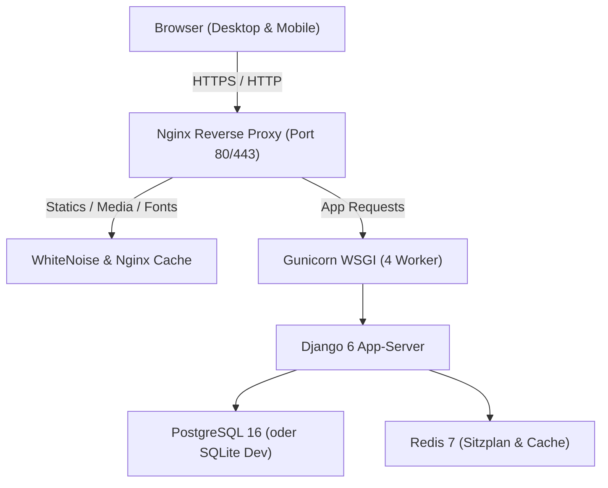

# 🚀 EntailsNG – Entwickler-Übergabe & Projektstatus (Developer Handover)

> **Stand:** September 2026  
> **Repository:** `entails-ng`  
> **Git-Branch:** `main` (Up-to-date mit `origin/main`, Clean State)  
> **Test-Status:** 🟢 **370 von 370 Tests erfolgreich bestanden** (0 Fehler, 0 Warnungen)  
> **Python / Django:** Python 3.12+ (kompatibel mit 3.14) / Django 6.0  

---

## 📌 1. Projekt-Steckbrief & Zielsetzung

**EntailsNG** ist eine moderne, hochperformante Open-Source-Webplattform für das Management von LAN-Partys, Gaming-Events und E-Sports-Turnieren für Veranstaltungen von **50 bis 1.000+ Teilnehmern**.

### Kerncharakteristika
1. **100% Offline-LAN-fähig (Zero-External-Leak):**
   * Keine Abhängigkeiten zu externen CDNs (Google Fonts liegen lokal als `.woff2` in `static/fonts/`).
   * QR-Codes (Check-in-Tickets und SEPA-GiroCodes) werden vollständig serverseitig per Python (`qrcode`) im Speicher generiert – keine Datenübertragung an Drittanbieter-APIs.
2. **Hybrides Deployment:**
   * Läuft wahlweise auf einem Heimserver hinter **Cloudflare Tunnel** (ohne Router-Portfreigaben, ohne Redirect-Loops), auf einem regulären **Linux-VPS** mit automatischen Let's-Encrypt-Zertifikaten oder komplett autark vor Ort auf einem **Offline-Laptop/Server**.
3. **Konfigurierbar & Mehrsprachig:**
   * Über 185 Systemtexte und Spielmodi können dynamisch im Admin-Bereich angepasst werden (`SystemTranslation`).
   * 9 integrierte Themes (Warm Amber, Cyberpunk Neon, Terminal Green/Mainframe, Quake 99, Arena Pro, etc.) mit globaler UI-Skalierung.

---

## 🏗️ 2. Architektur & Tech-Stack



| Komponente | Technologie | Zweck & Besonderheiten |
|---|---|---|
| **Backend** | Python 3.12+ / Django 6.0 | Robuster Monolith mit domänenspezifischem Service-Layer (Turniere, Zahlungen, E-Mail Outbox) |
| **Datenbank** | PostgreSQL 16 (Prod) / SQLite 3 (Dev/Test) | Umschaltbar über `DB_ENGINE=sqlite` oder `DB_ENGINE=postgres` |
| **Caching & Queue** | Redis 7 / Django Cache Framework | Sitzplan-Reservierungs-Cache, Session-Store, Translations-Cache |
| **Webserver** | Nginx & WhiteNoise | Gunicorn-Proxy mit Cloudflare-Tunnel-Erkennung & Fallback-Certs |
| **Frontend** | Vanilla ES6 JS + Semantic CSS Variables | Kein schweres JS-Framework (React/Vue), dadurch blitzschnelle Ladezeiten |
| **Fonts & Assets** | Barlow Condensed, DM Sans, JetBrains Mono | 100% lokal eingebunden via `static/css/fonts.css` |

---

## 📦 3. App- & Modul-Übersicht

Das Projekt ist in saubere Django-Apps unterteilt:

### 🎟️ `events` (Event-, Ticket- & Check-in-Management)
* **Modelle:** `Event`, `TicketCategory`, `EventRegistration`.
* **Services:** `PaymentService` (`events/services.py`) entkoppelt Seiteneffekte (Sitzplatz-Reservierung, Zahlungs-Mail, Cache-Invalidierung) sauber von den Models.
* **Aktives Event:** Immer über `Event.objects.get_active()` abfragen (Single Source of Truth).
* **Helfer Check-in Scanner (`/checkin/scanner/`):** Vor-Ort-Kamera-QR-Scan für Helfer mit akustischem Feedback und Ausweis-Abgleich (`can_check_in()`).
* **GiroCode (EPC-QR):** Generiert SEPA-Überweisungs-QRs mit vorbefülltem Betrag und Verwendungszweck.

### 🏆 `tournaments` (Turnier-Engine)
* **Modi:** Single Elimination, Double Elimination, Liga (Round Robin), Gruppenphase + K.O., Free For All (FFA).
* **Services:**
  * `TournamentBracketService`: Generierung aller Turnierbäume inkl. automatischer Freilos-Verteilung (BYEs).
  * `TournamentMatchService`: Score-Verarbeitung, Gewinner-Vorlauf, Bracket-Reset, Walkover-Automatisierung beim Löschen von Teams.
* **Highlights:**
  * **Loser-Reporting mit Fairplay-Schutz:** Unterlegene Teams können die eigene Niederlage selbst erfassen (`is_loser_reporting`), ohne auf Admins warten zu müssen. Siege können nicht eigenmächtig vergeben werden.
  * **Double Elimination 3-Teilung:** Getrennte Bereiche für Winner Bracket (grün), Loser Bracket (orange) und zentrierte goldene Abschluss-Kachel für das **Grand Final**.
  * **Siegerehrung & Podium:** Dynamische Berechnung von Platz 1, 2 und 3 nach Match-Abschluss.
  * **Admin-Vorschau:** Interaktiver Simulations-Tab für Admins vor Turnierstart.
  * **Dynamische Bezeichnungen:** Spielmodi und Stati können via `SystemTranslation` im Admin gewartet werden.

### 🗺️ `seating` (Interaktiver 2D-Sitzplan)
* **Modelle:** `SeatingPlan`, `SeatingCell`.
* **Editor & Viewer:** Modularisiertes JavaScript (`static/js/seating.js`), Zoom & Pan, Toast-Feedback und HTML-Modals (keine nativen `alert`/`confirm`-Popups).
* **Feature:** Konfigurierbare Überschreibung unbezahlter Sitzplätze (`allow_unpaid_seat_overwrite`) mit automatischer E-Mail-Benachrichtigung (`seat_overwritten`).

### 👥 `users` (Authentifizierung & Sicherheit)
* **Login:** Flexibel per E-Mail oder Benutzername über `CustomAuthenticationBackend`.
* **Brute-Force & Rate-Limiting:** Echte Client-IP-Erkennung hinter Proxies (`CF-Connecting-IP`, `X-Real-IP`).
* **Double-Opt-In:**
  * Bei Registrierung (6-stelliger Code).
  * Bei E-Mail-Änderung im Profil: Bisherige E-Mail bleibt intakt, neuer Code geht an die Zieladresse (kein Aussperren bei Tippfehlern!).

### 🛡️ `clans` (Clan-System)
* Clans, Logos, Beitrittspasswörter.
* **Partieller UniqueConstraint:** Ein Benutzer kann immer nur in **maximal einem aktiven Clan** Mitglied sein (`condition=Q(status='ACCEPTED')`).
* Inline-Bestätigungen für Kicken und Verlassen (ohne störende Browser-Popups).

### ⚙️ `configuration` (CMS, Themes & System-Services)
* **Translations:** `SystemTranslation` & `configuration/translations.py`.
  * Globale Hilfsfunktion `get_translation(key, default, **kwargs)`.
  * Globales Template-Tag `` (als Builtin registriert – kein `` nötig!).
* **Themes & Branding:** Live-Anpassung von Farbschemata, Logo und `UIScale`.
* **Error-Logging:** `DynamicDebugMiddleware` loggt ungefangene 500er-Fehler persistent als `SystemErrorLog` in die DB und vergibt eine Referenz-ID für den Benutzer.

### 📄 `info`, `news`, `emails`, `sponsors`
* `info`: Leichtgewichtiges Mehrseiten-CMS mit Slug-Routing (`/info/<slug>/`) und automatischer Menü-Synchronisation (`NavigationItem`).
* `news`: Newsartikel mit TinyMCE-Editor.
* `emails`: Multi-Backend-E-Mail-Versand (SMTP, Resend API, Console) mit verschlüsselter Speicherung von Passwörtern (`FIELD_ENCRYPTION_KEY`).
* `sponsors`: Partner- und Sponsoren-Verwaltung.

---

## 💻 4. Entwickler-Setup & Lokale Ausführung

### Voraussetzungen
* Python 3.12 oder 3.13 / 3.14
* SQLite (Dev) oder Docker/Podman (PostgreSQL 16 + Redis 7)

### Schritt-für-Schritt Einrichtung

```bash
# 1. Repository klonen & Verzeichnis betreten
git clone <repo-url> entails-ng
cd entails-ng

# 2. Virtuelle Umgebung erstellen & aktivieren
python3 -m venv .venv
source .venv/bin/activate

# 3. Abhängigkeiten installieren
pip install --upgrade pip
pip install -r requirements.txt

# 4. Umgebungskonfiguration (.env) anlegen
cp .env.example .env
# Für SQLite Development: Sicherstellen, dass DB_ENGINE=sqlite gesetzt ist

# 5. Datenbank migrieren
python manage.py migrate

# 6. Obligatorische System-Seeds ausführen (Idempotent!)
python manage.py seed_translations    # Befüllt über 500 Systemtexte in die DB
python manage.py seed_features        # Richtet Standard-Navigationspunkte & Icons ein (NavigationItem)
python manage.py seed_email_templates # Richtet alle HTML-E-Mail-Vorlagen ein
# (Hinweis: Die Kontext-Processor-Keys 'features' und 'feature_flags' sind reservierte Platzhalter für künftige Feature-Toggles.)

# 7. (Optional) Testdaten & Standard-Accounts laden
python manage.py loaddata initial_data.json
# Standard-Zugänge aus Demo-Daten:
# Superadmin: sadmin / EntailsDemo2026!
# Orga-User:  organizer / EntailsDemo2026!
# Gamer-User: gamer1 / EntailsDemo2026!

# 8. Entwicklungs-Server starten
python manage.py runserver
```

---

## 🧪 5. Testing & Qualitätssicherung

Das Projekt verfügt über eine umfassende automatisierte Testsuite (**370 Tests** über alle Module, 100% bestanden).

> [!NOTE]
> Die 370 Tests stellen den Testumfang dar. Zur Ermittlung der metrischen Zeilen- und Verzweigungsabdeckung (Code Coverage) wird das Tool `coverage` empfohlen:
> ```bash
> coverage run manage.py test
> coverage report
> ```

> **Wichtiger Hinweis zu Parallelitätstests & Zeilensperren:**  
> SQLite prüft `select_for_update()` nicht (`has_select_for_update = False`). Während logische Datenbank-Constraints (wie `UniqueConstraint`) auch auf SQLite greifen, sollten Zeilensperren-Konflikte (`FOR UPDATE`) gezielt unter **PostgreSQL** mit `TransactionTestCase` und getrennten Datenbankverbindungen getestet werden.

### Tests ausführen

```bash
# Gesamte Testsuite ausführen (SQLite im Speicher):
DB_ENGINE=sqlite python manage.py test

# Gezielt nur das Turniermodul testen:
DB_ENGINE=sqlite python manage.py test tournaments

# Gezielt Sitzplan & Events testen:
DB_ENGINE=sqlite python manage.py test seating events

# Testlauf mit Failfast (bricht beim ersten Fehler ab):
DB_ENGINE=sqlite python manage.py test --failfast
```

---

## 📐 6. Wichtige Programmier- & Design-Richtlinien

Wenn du neuen Code schreibst oder bestehende Funktionen erweiterst, beachte bitte folgende Konventionen:

### 1. Service-Layer Pattern (fortlaufende Umsetzung)
* **Status:** Vollständig umgesetzt in `tournaments/services.py` (`TournamentBracketService`, `TournamentMatchService`), `events/services.py` (`PaymentService`) und `emails/services.py` (Transactional Outbox & Rendering).
* **Entwicklungsziel:** Geschäftslogik schrittweise aus Views und Models in Services auslagern. Domänenlogik in `SeatingCell.reserve_for_user()` (`seating/models.py`) und Profil-/Verifizierungsabläufe in `users/views.py` sind künftige Kandidaten für die vollständige Kapselung in dedizierte Services (`seating/services.py`, `users/services.py`).
* Model-Methoden delegieren an Services (z. B. `EventRegistration.mark_as_paid()` delegiert an `PaymentService.mark_paid()`).

### 2. Single Source of Truth für das aktive Event
* **Niemals** `Event.objects.filter(is_active=True).first()` aufrufen!
* **Immer** `Event.objects.get_active()` verwenden. Diese Methode cached das aktive Event intelligent (Request-Cache + Redis) und garantiert Konsistenz über alle Apps.

### 3. Übersetzungen & Texte
* **Niemals** benutzerseitige Strings hardcodieren!
* **In Templates:** ``
  *(Hinweis: `translations` ist in `TEMPLATES['OPTIONS']['builtins']` registriert – kein `` erforderlich!)*
* **In Python-Code / Flash Messages:**
  ```python
  from configuration.translations import get_translation
  msg = get_translation("mein_key", "Mein Fallback-Text {name}", name=user.username)
  messages.success(request, msg)
  ```
* Neue Standardschlüssel in `configuration/translations.py` im Dictionary `DEFAULT_TEXTS` ergänzen und anschließend `python manage.py seed_translations` ausführen.

### 4. Keine nativen Browser-Dialoge (`confirm` / `alert`)
* Moderne Web-UX: Verwende **keine** synchronen Browser-Dialoge (`confirm(...)` oder `alert(...)`).
* Für Aktionen mit Bestätigung (Löschen, Verlassen, Kicken, Bracket-Generierung) nutzen wir das **Inline 2-Schritt-Pattern**:
  1. Klick auf den Aktionsbutton blendet den Button aus und einen kleinen Bestätigungscontainer ein (`#action-confirm`).
  2. Enthält `✓ Ja` und `✕ Abbrechen`.
* Für Fehlermeldungen in Modals nutzen wir dedizierte Fehler-Container (z. B. `#scoreFormError`).

### 5. Caching & Redis-Ausfallsicherheit
* Verwende für Cache-Löschungen immer `safe_cache_delete(...)` aus `configuration.cache` bzw. `configuration.models`, damit ein temporärer Redis-Ausfall niemals Datenbank-Transaktionen abbricht.

---

## 🚀 7. Deployment-Optionen im Überblick

| Modus | Startbefehl | Wann nutzen? |
|---|---|---|
| **🟢 Weg A: Cloudflare Tunnel** | `docker compose --profile tunnel up -d` | **Empfohlen** für Heimserver, Mini-PCs & lokale VMs. Keine Portweiterleitung im Router nötig; vollautomatisches SSL. |
| **🔵 Weg B: Linux-VPS** | `bash nginx/init-letsencrypt.sh` | Für öffentliche Server (Hetzner, Netcup etc.) mit eigener IPv4 und offenen Ports 80/443. |
| **🟡 Weg C: Offline / Vor-Ort** | `./start.sh` | Autarker Betrieb in Schützenheimen oder Hallen ohne Internetanbindung. |

*(Ausführliche Schritt-für-Schritt-Anweisungen finden sich in `INSTRUCTIONS.MD`.)*

---

## 📋 8. Empfohlene nächste Schritte (Backlog für Weiterentwickler)

Falls du weiter an EntailsNG arbeiten möchtest, sind hier die aktuell sinnvollsten Ausbaustufen und Ideen:

1. **Turnier-Erweiterungen:**
   * **Live-Ticker / WebSockets:** Automatische Aktualisierung des Turnierbaums via HTMX-Polling oder WebSockets, sobald ein Ergebnis eingetragen wird (aktuell über standardmäßigen Seiten-Reload).
   * **Turnier-Exporte:** Exportfunktion der Brackets als PDF oder JSON/Challonge-Kompatibilität.
2. **Check-in & Einlass-Statistiken:**
   * Ein Live-Dashboard-Widget für Orga-Admins, das anzeigt, wie viele Prozent der Gäste bereits eingecheckt sind und zu welchen Stoßzeiten der Einlass stattfand.
3. **Sitzplan-Export:**
   * Export des finalen Sitzplans mit Namen als Druck-PDF (A3/A4) zum Aushängen am Halleneingang.
4. **Clan-Turnier-Statistiken:**
   * Aggregierte Clan-Rankings über mehrere Turniere hinweg (Clan-Meisterschaft).

---

*Viel Erfolg bei der Weiterentwicklung von EntailsNG! Bei Fragen helfen die Unittests in den jeweiligen App-Ordnern (`tests.py`) als ideale Dokumentation der erwarteten Verhaltensweisen.*
