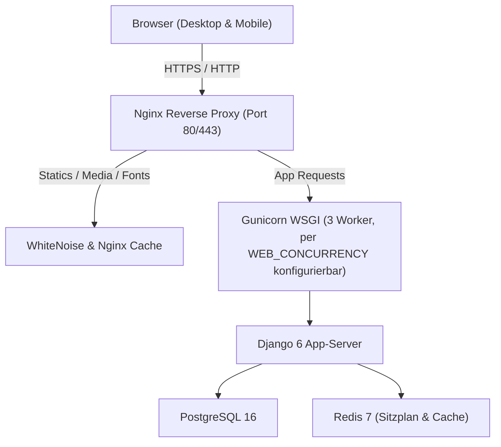

# 🚀 EntailsNG – Entwickler-Übergabe & Projektstatus (Developer Handover)

> **Stand:** Oktober 2026
> **Repository:** `entails-ng`  
> **Git-Branch:** Aktuellen Arbeitsstand mit `git status` prüfen
> **Aktueller Prüfstand (8. Oktober 2026, Kontaktformular):** Öffentliche Kontaktseite `/kontakt/` mit vorbefüllter, bearbeitbarer Gastadresse, administrierbaren Betreffkategorien und Nachricht. Aktivierung, Standardempfänger und Kategorien direkt unter Allgemeine Konfiguration; mehrere Empfänger mit `;`, Validierung und Duplikatbereinigung, Kategorieempfänger ersetzen die Standardliste. Atomare Aufträge pro Empfänger in der bestehenden Outbox, individuelles Reply-To und Empfängersnapshot, Schutz vor Doppelübermittlung und datenbankgestützte Versandlimits; Kontolöschung bereinigt zugeordnete Kontaktkopien. **1.244 Python-Tests erfolgreich, keine Überspringungen**, einschließlich **38 neuer Tests (drei PostgreSQL-Paralleltests)**; JavaScript-Dateiprüfungen, Django-Systemprüfung, globaler Migrationsabgleich und Diff-Prüfung erfolgreich. Backend-Speichern, Gastanmeldung, Mehrfachempfänger und Desktop-/Mobilansichten (390/320 Pixel) im Browser geprüft. Migrationen und Vorschau ausschließlich auf isolierten PostgreSQL-Datenbanken; Anwendungsdatenbank nicht migriert, kein Deployment oder realer SMTP-Versand. Einführung: `migrate`, `seed_translations`, `seed_features`, `seed_email_templates`, `collectstatic`, Neustart der Web-/Mailprozesse. Anleitung: [Kontaktformular](docs/contact-form.md).
> **Aktueller Prüfstand (8. Oktober 2026, einheitliche Frontend-Links):** Gemeinsame Textlinks, Aktionsbuttons, verlinkte Überschriften, Karten, Bilder, Tabs und Badges über `static/css/links.css`. Inline-Linkfarben und konkurrierende Modulregeln bereinigt; alle Auth-Seiten verwenden das gemeinsame Theme-Include. Kontrastreiche Beschriftungen für primäre Aktionen, sichtbarer Tastaturfokus und mobile Umbrüche. **1.206 Python-Tests und 31 JavaScript-Tests erfolgreich**; **151 Browseransichten mit 612 Links**, 1440/390/320 Pixel und alle neun Themes ohne Prüffehler. 93 Templates kompiliert, Ziele und Verhalten von 159 bestehenden Links unverändert; Django-Systemprüfung, Migrationsabgleich und `collectstatic` erfolgreich. Keine Datenbankmigration für die Link-Umstellung nötig. Konventionen und Bereitstellung: [Frontend-Links](docs/link-styling.md).
> **Aktueller Prüfstand (8. Oktober 2026, Auslosungsvorschau):** Vollständige Suite mit **1.206 Python-Tests erfolgreich, keine Überspringungen**, gegen eine isolierte PostgreSQL-18.6-Instanz. **31 neue Funktionstests, sechs neue PostgreSQL-Paralleltests und 31 JavaScript-Tests** erfolgreich; Django-Systemprüfung, globaler Migrationsabgleich, Python-Syntax und Diff-Prüfung erfolgreich. Alle sechs Turniermodi im Browser bis zum Start aus der geprüften Vorschau getestet, einschließlich Clan-Auswahl, Neuauslosung, manuellem Tausch und Konfliktfreigabe. Mobilansichten bei 390/320 Pixeln ohne Seitenüberlauf. Anwendungsdatenbank nicht migriert, kein Deployment ausgeführt. Bedienung und Einführung: [Turnierauslosung](docs/tournament-draws.md).
> **Aktueller Prüfstand (8. Oktober 2026, externe Turniere):** Vollständige Suite mit **1.169 Python-Tests erfolgreich, keine Überspringungen**, gegen eine isolierte PostgreSQL-18.6-Instanz einschließlich nativer Backups und Parallelitätsprüfungen. **25 neue Funktionstests** und **26 JavaScript-Tests** erfolgreich; Django-Systemprüfung, globaler Migrationsabgleich und Diff-Prüfung erfolgreich. Gemeinsame Turnierübersicht sowie Mobilansichten bei 390/320 Pixeln im Browser geprüft. Migration und Vorschau ausschließlich auf isolierten Datenbanken; Anwendungsdatenbank nicht migriert, kein Deployment ausgeführt. Bedienung und Einführung: [Externe Turniere](docs/external-tournaments.md).
> **Aktueller Prüfstand (7. Oktober 2026, Clan-Sammelzahlungen):** Vollständige Suite mit **1.144 Python-Tests erfolgreich, keine Überspringungen**, gegen eine isolierte PostgreSQL-18.6-Instanz. **26 JavaScript-Tests**, Django-Systemprüfung, Migrationsabgleich, Python-Syntax und Diff-Prüfung erfolgreich. Browserablauf mit Auftragserstellung, Orga-Bestätigung, Neuanmeldung, Zuweisung, Ersetzung und Stornierung sowie Desktop-/Mobilansicht geprüft. 44 neue Funktionstests und neun neue PostgreSQL-Paralleltests. GitHub-CI und Docker-Imagebau wurden lokal nicht ausgeführt. Die Anwendungsdatenbank wurde nicht migriert; Einführung und Betriebsgrenzen: [Clan-Sammelzahlungen](docs/clan-seat-payments.md).
> **Prüfstand der PostgreSQL-Umstellung (5. Oktober 2026):** Vollständige Suite mit **994 Python-Tests erfolgreich, keine Überspringungen**, gegen eine isolierte PostgreSQL-18.6-Instanz mit passenden nativen Backup-Programmen. **24 JavaScript-Tests** sowie Python-/Shell-Syntax, Compose-Konfiguration und Diff-Prüfung erfolgreich. Verbindungscheck für erreichbare und fehlende PostgreSQL-Instanz geprüft. CI ist auf einen vollständigen PostgreSQL-16-Lauf umgestellt; GitHub-CI und Docker-Imagebau wurden lokal nicht ausgeführt. Der bisherige Unterschied bei den drei Farbvalidatoren ist durch `configuration.0022_sitecustomization_color_validators` behoben; der globale Migrationsabgleich ist erfolgreich. Die PostgreSQL-Umstellung selbst benötigt keine Migration.
> **Historischer Test-Status:** Vollständiger Projektlauf am **1. Oktober 2026: 715 Tests, 695 erfolgreich, 20 PostgreSQL-Fälle auf SQLite übersprungen**, keine Fehler. Anschließend alle **38 Knowledge-Tests: 35 erfolgreich, 3 PostgreSQL-Fälle übersprungen**, einschließlich eines ergänzten Vergleichsfalls. Frühere Turnierprüfung: **12 JavaScript-Tests erfolgreich**. Details und Grenzen: [Interne Wissensbasis](docs/internal-knowledge-base.md), [Turnierprüfung](docs/tournament-audit-2026-10-01.md). Weitere Erweiterungen: [Solo-Reaktivierung](docs/solo-team-reactivation.md), [Schweizer Turniere](docs/swiss-tournaments.md). Der damals offene Migrationscheck zu den drei Farbvalidatoren wurde am 5. Oktober 2026 durch `configuration.0022_sitecustomization_color_validators` behoben.
> **Umstellung vom 5. Oktober 2026:** Nur PostgreSQL in allen Umgebungen. Die SQLite-Integration einschließlich Backup-Adapter, automatischem Fallback und spezifischem Test wurde entfernt; die lokale Datenbank wurde ohne Datenübernahme gelöscht. `DB_ENGINE` entfällt. Historische Testergebnisse unten und in den Fachberichten beschreiben frühere Softwarestände.
>
> **Python / Django:** Python 3.12+ (kompatibel mit 3.14) / Django 6.0  

> **Historische Regression vom 3. Oktober 2026:** Vollständiger SQLite-Projektlauf:
> **822 Tests, 799 erfolgreich, 23 übersprungen**, keine Fehler. Backup-Modul
> zusätzlich nativ gegen PostgreSQL 16.15: **47 Tests, 45 erfolgreich, zwei
> übersprungen** (POSIX-Dateirechte unter Windows und SQLite-Dateiverbindungen).
> **12 JavaScript-Tests** und
> Syntaxprüfung des Backup-JavaScripts erfolgreich. Docker-Imagebau und CI wurden
> lokal nicht ausgeführt. Der damals offene globale Migrationscheck zu drei
> Farbvalidatoren ist seit `configuration.0022_sitecustomization_color_validators` behoben; das Backup-Modul benötigt keine Migration.

---

## 📌 1. Projekt-Steckbrief & Zielsetzung

**EntailsNG** ist eine moderne, hochperformante Open-Source-Webplattform für das Management von LAN-Partys, Gaming-Events und E-Sports-Turnieren für Veranstaltungen von **50 bis 1.000+ Teilnehmern**.

### Kerncharakteristika
1. **100% Offline-LAN-fähig (Zero-External-Leak):**
   * Optional konfigurierte iframe-Seiten laden bewusst Inhalte ihres freigegebenen Anbieters. Diese Inhalte benötigen dessen Erreichbarkeit; die Kernanwendung bleibt unabhängig davon lokal nutzbar.
   * Keine Abhängigkeiten zu externen CDNs (Google Fonts liegen lokal als `.woff2` in `static/fonts/`).
   * QR-Codes (Check-in-Tickets und SEPA-GiroCodes) werden vollständig serverseitig per Python (`qrcode`) im Speicher generiert – keine Datenübertragung an Drittanbieter-APIs.
2. **Hybrides Deployment:**
   * Läuft wahlweise auf einem Heimserver hinter **Cloudflare Tunnel** (ohne Router-Portfreigaben, ohne Redirect-Loops), auf einem regulären **Linux-VPS** mit automatischen Let's-Encrypt-Zertifikaten oder komplett autark vor Ort auf einem **Offline-Laptop/Server**.
3. **Konfigurierbar & Mehrsprachig:**
   * Über 185 Systemtexte und Spielmodi können dynamisch im Admin-Bereich angepasst werden (`SystemTranslation`).
   * 9 integrierte Themes (Warm Amber, Cyberpunk Neon, Terminal Green/Mainframe, Quake 99, Arena Pro, etc.) mit globaler UI-Skalierung.

---

## 🏗️ 2. Architektur & Tech-Stack


```mermaid
graph TD
    Client["Browser (Desktop & Mobile)"] -->|HTTPS / HTTP| Nginx["Nginx Reverse Proxy (Port 80/443)"]
    Nginx -->|Statics / Media / Fonts| StaticFiles["WhiteNoise & Nginx Cache"]
    Nginx -->|App Requests| Gunicorn["Gunicorn WSGI (3 Worker, per WEB_CONCURRENCY konfigurierbar)"]
    Gunicorn --> Django["Django 6 App-Server"]
    Django --> Postgres["PostgreSQL 16"]
    Django --> Redis["Redis 7 (Sitzplan & Cache)"]
```

| Komponente | Technologie | Zweck & Besonderheiten |
|---|---|---|
| **Backend** | Python 3.12+ / Django 6.0 | Robuster Monolith mit domänenspezifischem Service-Layer (Turniere, Zahlungen, E-Mail Outbox) |
| **Datenbank** | PostgreSQL 16 | Verbindlich für Produktion, lokale Entwicklung, Offline-Betrieb und Tests; Konfiguration über `DB_NAME`, `DB_USER`, `DB_PASSWORD`, `DB_HOST`, `DB_PORT` |
| **Caching & Queue** | Redis 7 / Django Cache Framework | Sitzplan-Reservierungs-Cache, Session-Store, Translations-Cache |
| **Webserver** | Nginx & WhiteNoise | Gunicorn-Proxy mit Cloudflare-Tunnel-Erkennung & Fallback-Certs |
| **Frontend** | Vanilla ES6 JS + Semantic CSS Variables | Kein schweres JS-Framework (React/Vue), dadurch blitzschnelle Ladezeiten |
| **Fonts & Assets** | Barlow Condensed, DM Sans, JetBrains Mono | 100% lokal eingebunden via `static/css/fonts.css` |

### Worker und Betriebskonfiguration

Der `web`-Container startet Gunicorn mit standardmäßig **3 Web-Workern**. Die Zahl wird über `WEB_CONCURRENCY` in `.env` gesetzt; das Dockerfile gibt 3 vor, falls die Variable fehlt. Der feste `--workers`-Parameter wurde entfernt, damit Gunicorn die Variable auswertet. Nach einer Änderung muss der Web-Container mit `docker compose up -d --build --force-recreate web` neu erstellt werden. `WEB_CONCURRENCY` wirkt nicht auf `./start.sh` beziehungsweise Djangos Entwicklungsserver und verändert auch nicht die Zahl der PostgreSQL-Worker.

Die Worker-Zahl gehört zur Deployment-Konfiguration und nicht zu `GeneralConfiguration` im Django-Admin: Ein Datenbankwert kann laufende Gunicorn-Prozesse nicht zuverlässig und dauerhaft umstellen. Zusätzliche Web-Worker verbrauchen RAM, halten potenziell weitere Datenbankverbindungen offen und können die Wartezeit an der Event-Zeilensperre erhöhen. Die lokale [Lastmessung](docs/performance-smoke-2026-09-26.md) zeigte bei 32 parallelen Anmeldungen 52,9 ms p95 und bis zu 31 wartende PostgreSQL-Sessions; das ist kein Anlass, PostgreSQL-Parallel-Worker pauschal zu erhöhen.

PostgreSQL-Parameter wie [`max_worker_processes`](https://www.postgresql.org/docs/16/runtime-config-resource.html#RUNTIME-CONFIG-RESOURCE-ASYNC-BEHAVIOR) sind separate Serverparameter; `max_worker_processes` wird erst beim Start des Datenbankservers wirksam. Sie sollten nur anhand konkreter Datenbankabfragen und Serverressourcen angepasst werden. Ebenso ist `email_worker` in `docker-compose.yml` ein eigener Prozess für die E-Mail-Warteschlange und unabhängig von `WEB_CONCURRENCY`.

---

## 📦 3. App- & Modul-Übersicht

Das Projekt ist in saubere Django-Apps unterteilt:

### 🎟️ `events` (Event-, Ticket- & Check-in-Management)
* **Modelle:** `Event`, `TicketCategory`, `EventRegistration`.
* **Services:** `PaymentService` (`events/services.py`) entkoppelt Seiteneffekte (Sitzplatz-Reservierung, Zahlungs-Mail, Cache-Invalidierung) sauber von den Models.
* **Aktives Event:** Immer über `Event.objects.get_active()` abfragen (Single Source of Truth).
* **Helfer Check-in Scanner (`/checkin/scanner/`):** Kamera, USB-/Code-Eingabe und Teilnehmerliste zeigen auf dem Scanner-Gerät eine große Bestätigung mit Nickname, Sitzplatz und lokaler Uhrzeit. Drei Sekunden Lesepause und Unterdrückung dauerhaft sichtbarer QR-Codes verhindern das Überschreiben durch Mehrfachscans. Ablehnungen und unbestätigte Verbindungsfehler sind sichtbar; Ton/Vibration ergänzen die Anzeige. Die Enter-Suche checkt ausschließlich ein. Zentrale Prüfung über `can_check_in()`. Details und Testnachweise: [Scanner-Rückmeldung](docs/scanner-feedback.md).
* **Veranstaltung abschließen:** Die Admin-Eventliste bietet eine Abschlussaktion mit Bestätigungsseite. `EventLifecycleService.finish_event()` verlangt, dass alle Turniere beendet oder abgesagt sind, beendet und deaktiviert das Event atomar und archiviert seine Teams. Entwürfe und abgesagte Events können nicht abgeschlossen werden. Das reguläre Admin-Formular verhindert den direkten Abschluss und die Wiederöffnung eines abgeschlossenen Events.
* **Anmeldung öffnen:** Die Aktion „Bereitschaft prüfen und Anmeldung öffnen“ in der Admin-Eventliste zeigt Sperrgründe (Entwurfsstatus, gültiger künftiger Zeitraum, Ort, Kapazität, keine andere aktive Veranstaltung, aktive Tickets, betriebsbereite E-Mail-Konfiguration und bei kostenpflichtigen Tickets Zahlungsdaten) sowie Hinweise (Beschreibung, Sitzplan, E-Mail-Testmodus). `EventLifecycleService.open_registration()` prüft beim Bestätigen erneut und öffnet die Anmeldung atomar. Das Admin-Formular verhindert einen direkten Wechsel auf „Anmeldung geöffnet“. Beim Anlegen eines Events wird ein Standardticket nur erzeugt, wenn nach dem Speichern der Ticket-Inlines keine Kategorie vorhanden ist.
* **Sperren nach Eventende:** Abgelaufene und abgeschlossene Events erlauben keinen neuen Check-in oder neue Turnieranmeldungen mehr. Die Prüfungen sitzen in den zentralen Modellen und Services; Eventabschluss, Check-in und Turnieranmeldung sperren die Event-Zeile zuerst.
* **GiroCode (EPC-QR):** Generiert SEPA-Überweisungs-QRs mit vorbefülltem Betrag und Verwendungszweck.

### 🖨️ `media_designer` (Vorlagen & Druckexport)
* **Vorlagen:** Eventgebundene Badge- und Urkundenvorlagen mit optionalem JPG/PNG/WebP-Hintergrund und validierten Textfeldern in relativen Koordinaten (`schema_version=1`). Der Editor ist unter `/media-designer/` für Mitarbeiter erreichbar.
* **Schriftarten:** `MediaFont` verwaltet TTF-, OTF- und WOFF2-Dateien bis 5 MB im Django-Admin. Jedes Textfeld kann eine verwaltete Schrift oder die Standardschrift wählen; Vorschau und PDF-Export verwenden die Auswahl. Beim Löschen werden Verweise in vorhandenen Vorlagen auf die Standardschrift zurückgesetzt und die Datei nach dem Datenbank-Commit entfernt.
* **Seriendruck:** Badges verwenden Anmeldungen; die Empfänger können nach Bezahlstatus und zugewiesenem Sitzplatz gefiltert werden. Stornierte Anmeldungen bleiben ausgeschlossen. Urkunden verwenden angemeldete Teams abgeschlossener Turniere. Platzierungen kommen aus `TournamentPodiumService`; unbekannte Platzierungen bleiben leer. Die Orga kann pro Export eine frei benannte Auszeichnung vergeben.
* **Zusätzliche Felder:** Veranstaltungsbeginn und -ende stehen mit lokaler Uhrzeit für Badges und Urkunden bereit. Urkunden können bestätigte Teammitglieder zeilenweise als Gamer-Tags ausgeben; maßgeblich ist der aktuelle Teamkader beim Export, kein historischer Turnier-Snapshot.
* **Druck:** Serverseitige PDF-Erzeugung mit Pillow bei 300 DPI. A6/A7/A8-Badges sind einzeln oder auf A4-Bögen mit 5 mm Rand, 4 mm Abstand und Schnittmarken exportierbar (A8: 9 pro Bogen). A4-Urkunden werden einzeln ausgegeben.
* **Grenzen der ersten Version:** Hochformat und keine Druckbeschnittzugabe. Hintergründe werden proportional zugeschnitten. Die Textvorschau verwendet Beispieldaten; der Export verkleinert lange Texte bis auf 1,5 mm und meldet danach einen Fehler.

### 🏆 `tournaments` (Turnier-Engine & Team-Management)
* **Auslosungsvorschau (8. Oktober 2026):** Gemeinsamer Ablauf „Auslosung vorbereiten“ für alle sechs Modi. Signierte, 30 Minuten gültige Entwürfe ohne Vorschau-Schreibzugriffe; automatische Clan-Minimierung, manuelles Tauschen und standardmäßig feste Seedpositionen. Optionaler `TournamentRegistration.draw_clan` je Turnier statt Tag-Ableitung, ausdrücklich übernommene Captain-Vorschläge; Zuordnung erst bei Freigabe gespeichert. Single/Double Elimination vermeiden Runde-1-Konflikte, Gruppenphase minimiert Clan-Begegnungen innerhalb beider Gruppen, Schweizer System und Liga optimieren ausschließlich ihre erste Runde, FFA prüft Teilnehmer ohne Paarungen. Unvermeidbare Konflikte benötigen bei aktiver Regel Bestätigung und Begründung. Exakte Vorschauübernahme, Kader-/Rechte-/Änderungsprüfung, atomarer und idempotenter Start mit schreibgeschütztem Auslosungsprotokoll; Admin- und alte Schweizer Startaktionen führen in denselben Ablauf. Neustarts übernehmen bestätigte Clan-Zuordnungen. Migration `tournaments.0016_draw_preview`, `seed_translations`, `collectstatic` und Neustart der Webprozesse erforderlich. Details und Grenzen: [Turnierauslosung](docs/tournament-draws.md).
* **Externe Turniere (8. Oktober 2026):** Eigenständiges Modell `ExternalTournament` mit Event-/Spielzuordnung, Anbietername, validierter HTTPS-Zieladresse, optionaler Kurzbeschreibung/Modus/Terminen und Entwurf/Veröffentlichung. Eigener Django-Admin mit Modellberechtigungen; externe Karten verwenden das vorhandene Raster und die Spiellogos. „Zum Turnier →“ öffnet direkt im selben Tab; lokale Anmeldestatus und Teilnehmerzahlen werden nicht auf externe Karten übertragen. Entwürfe sind nur für aktive Mitarbeiter sichtbar. Interne Services, Aktionsendpunkte, Ergebnisverwaltung und Urkunden bleiben unverändert; externe Einträge blockieren den Eventabschluss nicht. Keine Anbieterabfragen oder Einbettungen; die Übersicht bleibt offline darstellbar. Migration `tournaments.0015_external_tournament`, `seed_translations`, `collectstatic` und Neustart der Webprozesse erforderlich. Details und Testgrenzen: [Externe Turniere](docs/external-tournaments.md).
* **Prüfstand Ergebnisverwaltung (7. Oktober 2026):** Vollständige PostgreSQL-Suite: 1.058 Tests erfolgreich; abschließende gezielte Ergebnis-/Parallelitätsprüfung: 29 Tests erfolgreich; zusätzliche Prüfskripte für alle sechs Modi: 38 Tests erfolgreich; JavaScript: 24 Tests erfolgreich. Django-Systemprüfung, Migrationsabgleich und Backend-/Frontend-Browserprüfung erfolgreich. Auch K.-o.-Freigaben sind an die angezeigten Ergebnisse gebunden und werden nach zwischenzeitlichen Korrekturen abgelehnt.
* **Ergebnisverwaltung (7. Oktober 2026):** Gemeinsame Backend-Seite „Ergebnisse verwalten“ für alle sechs Modi einschließlich FFA; Frontend und Match-Admin verwenden zentrale Korrekturregeln. Expliziter Matchstart und Freigabe der Gruppen-K.-o.-Phase sichern die Teilnehmer ab. Siegerwechsel bauen ungespielte abhängige Matches einschließlich automatischer Freilose und DE-Reset neu auf; Score-Korrekturen mit gleichem K.-o.-Sieger bleiben bis zur Abschlussbestätigung möglich. Die letzte Wertung führt jetzt zu „Ergebnisse prüfen“; erst die Orga bestätigt „Beendet“, Podium, Urkunden und Eventabschluss. Begründungen, Vorher/Nachher-Werte, Bearbeiter und Folgeänderungen werden protokolliert. Veraltete Eingabe-/Startformulare und Abschlussbestätigungen werden abgelehnt. Migration `tournaments.0014_tournament_playoffs_released_at_and_more`, `seed_translations`, `collectstatic` und Neustart der Webprozesse erforderlich. Bestehende beendete Turniere bleiben gesperrt; bereits besetzte Gruppen-K.-o.-Paarungen werden als freigegeben übernommen. Details: [Ergebniseingabe und Korrekturen](docs/tournament-result-management.md).
* **Testerfeedback zur Turnieroberfläche (5. Oktober 2026):** Turnierstatus im Detailkopf unabhängig vom persönlichen Anmeldestatus; explizite Kaderkennzeichnung samt bestätigter Spielerzahl in Teilnehmerliste und eigenem Anmeldestatus. Urkunden-Link nur für Mitarbeiter nach Abschluss. Orgas können offene Anmeldungen separat per bestätigtem, CSRF-geschütztem POST schließen; Teams und Termine bleiben erhalten, Start/Generierung erfolgen später. Rechte und Zustand werden in `TournamentLifecycleService.close_registration()` mit Event-/Turniersperren erneut geprüft. Abgesagte Turniere zeigen keine Anmelde-/Startaktionen, Entwürfe behalten die Veröffentlichungsaktion. Merge-Konfliktmarkierungen in der Übersicht und doppelte Metadaten bereinigt; Originalverweis neuer Turnierausgaben im Frontend entfernt, interne Herkunft erhalten. `seed_translations`, `collectstatic` und Neustart der Webprozesse erforderlich; keine neue Migration. 346 Turniertests: 322 erfolgreich, 24 PostgreSQL-Fälle auf SQLite übersprungen; 19 neue Funktionstests und zwei neue PostgreSQL-Parallelfälle in CI. Details: [Turnieransichten und Anmeldung schließen](docs/tournament-frontend-feedback.md).
* **Teamgrößenregel pro Turnier (5. Oktober 2026):** Drei Regeln im Admin: vollständiger Kader bei Anmeldung und Start (Standard auch für Bestand), unvollständige Anmeldung mit Auffüllen bis zum Start, oder unvollständige Kader auch beim Start zulassen. Mindestens ein bestätigtes Mitglied und die maximale Spiel-Teamgröße bleiben verbindlich; offene Bewerbungen/Einladungen zählen nicht. Anmeldung belegt einen regulären Turnierplatz. Frontend zeigt Regel, Kaderstand und Auffüllhinweise; die Orga sieht vor der Generierung abweichende Kader. Öffentliche/adminseitige Starts prüfen alle betroffenen Teams atomar in allen sechs Modi. Regeländerungen und Start sind über dieselbe Turniersperre serialisiert; Regeln sind nach Generierung gesperrt und werden beim Neustart kopiert. Turnierkopf auf Smartphones korrigiert. Migration `tournaments.0013_tournament_roster_rule`, `seed_translations`, `collectstatic` und Neustart der Webprozesse erforderlich. 325 Turniertests: 303 erfolgreich, 22 PostgreSQL-Fälle auf SQLite übersprungen; 19 neue Funktionstests und zwei PostgreSQL-Parallelfälle in CI. Bedienung und Grenzen: [Teamgrößenregeln](docs/tournament-roster-rules.md).
* **Turnier-Neustarts im Backend (2. Oktober 2026):** Der Button „Neustart vorbereiten“ an einem Turnier erstellt für alle sechs Modi und alle Ausgangsstatus eine neue Ausgabe als Entwurf. Titel/Termine, Teamauswahl, Übernahme von Seeds und optionale Absage des offenen/laufenden Originals werden in einer Vorschau festgelegt. Ergebnisse, Gruppen, Rückzüge und Schweizer Runden beginnen neu; die ursprüngliche Historie bleibt erhalten. Signierte Vorschau, atomare Erstellung, Schutz gegen doppelte Formularübermittlung und schreibgeschützte Herkunftsprotokolle sind enthalten. Erforderlich: Mitarbeiterstatus sowie Rechte zum Anlegen/Ändern von Turnieren und zum Anlegen von Turnieranmeldungen. Archivierte Teams werden nicht automatisch reaktiviert; der Turnierstart prüft die aktuellen Kader. Beendete Events erlauben nur die Vorbereitung eines Entwurfs. Migration `tournaments.0011_tournament_restart` und `seed_translations` erforderlich. Bedienung und Tests: [Turnier-Neustarts](docs/tournament-restarts.md).
* **Verbesserungen aller sechs Modi (1. Oktober 2026):** Die Befunde aus der Einzelprüfung sind korrigiert: expliziter Schweizer Rettungsweg mit signierter Ausnahmevorschau und zusätzlicher Orga-Zustimmung, Ausschluss zurückgezogener Liga-Teams aus Platzierungen, Bereinigung überflüssiger Grand-Final-Resets, vollständige Ligaplatzierungen für Urkunden und vollständige aktive FFA-Ränge. Dazu kommen optionales kleines Finale, klare Rundennamen, DE-Kreuzverteilung, echtes Snake-Seeding sowie konfigurierbare Liga-/Gruppen-Gleichstandsregeln und Gruppenqualifikanten. Neue Regeln werden nach Generierung gesperrt; vorhandene Turniere behalten ihre historische Gleichstandsregel. Migration `tournaments.0010_format_improvements`, `seed_translations` und `collectstatic` erforderlich. Größerer Testlauf: 350 bestanden, 12 PostgreSQL-Fälle auf SQLite übersprungen; 38 separate Modusprüfungen und 5 JavaScript-Tests erfolgreich. Details und aktuelle Regressionen: [Umsetzung der Verbesserungen](docs/tournament-mode-improvements-2026-10-01.md); historischer Befundbericht: [Einzelprüfung der Modi](docs/tournament-mode-review-2026-10-01.md).
* **Entwürfe im Frontend (1. Oktober 2026):** Entwurfsturniere sind nur für angemeldete, aktive Mitarbeiter (`is_staff`) und Superadmins sichtbar. Gäste erhalten auch beim direkten Aufruf der Detail- und Turnieraktions-URLs keinen Zugriff; eine Zuweisung als Turnieradmin oder Support ersetzt den Mitarbeiterstatus nicht. Ein Klick auf „Entwurf“ in Übersicht oder Detailansicht öffnet die Anmeldung über einen CSRF-geschützten POST und `TournamentLifecycleService.open_registration()`. Die Aktion prüft den aktuellen Entwurfsstatus, sperrt Event und Turnier in dieser Reihenfolge und verhindert das Öffnen bei beendetem/abgesagtem Event oder generiertem Turnierbaum. Anmeldezeiträume bleiben erhalten. Keine Migration erforderlich; neue Texte über `seed_translations` verwalten. Tests: `tournaments.test_draft_visibility`.
* **Modi:** Single Elimination, Double Elimination, Liga (Round Robin), Gruppenphase + K.O., Free For All (FFA), Schweizer System.
* **Services:**
  * `TournamentBracketService`: Generierung aller Turnierbäume inkl. automatischer Freilos-Verteilung (BYEs).
  * `TournamentMatchService`: Score-Verarbeitung, Gewinner-Vorlauf, Bracket-Reset, Walkover-Automatisierung beim Löschen von Teams.
  * `SwissTournamentService`, `SwissPairingService`, `SwissStandingService`: rundenweise Auslosung und Orga-Freigabe, 3/1/0-Punkte, optionale Unentschieden, Buchholz/Sonneborn-Berger und geteilte Ränge. Reines Schweizer System ohne K.-o.-Phase.
* **Schweizer System (1. Oktober 2026):** Teilnehmer und Regeln werden mit Runde 1 festgeschrieben. Weitere Runden werden erst nach vollständigen Ergebnissen manuell freigegeben. Signierte Vorschauen, Rundenprotokolle und Datenbank-Constraints sichern die Veröffentlichung ab. Frühere Ergebnisse sind nach Freigabe der Folgerunde gesperrt; Rückzüge behalten die Historie. Urkunden übernehmen auch geteilte Ränge. Installation: Requirements aktualisieren, Migration `tournaments.0009` anwenden und `seed_translations` ausführen. Details und Testgrenzen: [Schweizer Turniere](docs/swiss-tournaments.md).
* **Team-Management:**
  * **Clanaufnahme und persönliche Einladungen (3. Oktober 2026):** Der aktuelle Kapitän kann bestätigte Mitglieder seines eigenen Clans per Mehrfachauswahl sofort aufnehmen und weitere Spieler per Nickname persönlich einladen. Clan-Adminrechte sind nicht nötig. Clanexterne Spieler müssen selbst annehmen oder ablehnen; der Kapitän kann Einladungen zurückziehen und Bewerbungen ablehnen. Ein späterer Clanaustritt lässt die Teammitgliedschaft bestehen. Der rote Punkt berücksichtigt offene eigene Einladungen und Bewerbungen an eigene Teams auf Desktop und Mobilgeräten. Kadergröße, ein aktives Team pro Spiel, Archiv-/Event-/Turniersperren und gemeinsame Benutzer-/Event-/Teamsperren bleiben maßgeblich. Einladungscode bleibt erhalten; offene Einladungen reservieren keine Plätze. Erforderlich: Migration `tournaments.0012_team_invitations`, `seed_translations`, `collectstatic`. SQLite-Gesamtlauf: 860 Tests, 831 erfolgreich, 29 übersprungen; 29 neue Funktionstests erfolgreich, sechs PostgreSQL-Paralleltests auf SQLite übersprungen und in CI aufgenommen. Bedienung, Lebenszyklus und Prüfgrenzen: [Teamaufnahme und Einladungen](docs/team-recruitment.md).
  * **Automatische Solo-Reaktivierung (1. Oktober 2026):** Die normale Einzelspieler-Anmeldung verwendet das aktuelle Team oder reaktiviert ein archiviertes Solo-Team desselben Accounts und Spiels. Team-ID und Turnierhistorie bleiben erhalten; die neue Turnieranmeldung übernimmt keine alten Ergebnisse oder Aufgaben. Laufende/generierte Turniere, offene alte Anmeldungen und widersprüchliche Kader werden vor dem Wechsel gesperrt. Ein erneuter Abschluss des früheren Events archiviert kein inzwischen reaktiviertes Team. Neue Accounts erhalten keinen Zugriff auf frühere Teams. Details und Tests: [Solo-Reaktivierung](docs/solo-team-reactivation.md). Keine zusätzliche Migration erforderlich.
  * **Spielbezug & Filter:** Teams zeigen das zugehörige Spiel (`team.game.name`); die Teamübersicht bietet Filter-Pills und Sortierung nach Spiel.
  * **Fairplay-Regel:** Ein Teilnehmer darf pro Spiel nur maximal einem aktiven Team angehören (verhindert Doppelteilnahmen).
  * **Benachrichtigungspunkt:** Roter Indikator am Menüpunkt „Teams“ (Sidebar & Mobile Nav) und im Team-Header bei offenen Beitrittsanfragen.
* **Highlights:**
  * **Dynamischer Anmeldestatus:** Buttons spiegeln den Status direkt wider (`✓ Angemeldet` vs. `🎮 Jetzt anmelden →`).
  * **Turnierstart:** Datenfeld `tournament_start` mit transparentem Fallback auf `registration_end` (`effective_tournament_start`).
  * **Responsive Kacheln:** `.tournament-grid` verhindert horizontales Scrollen auf Smartphones ($\le 390\text{px}$).
  * **Loser-Reporting mit Fairplay-Schutz:** Unterlegene Teams können die eigene Niederlage selbst erfassen (`is_loser_reporting`).
  * **Double Elimination 3-Teilung:** Getrennte Bereiche für Winner Bracket (grün), Loser Bracket (orange) und zentrierte goldene Abschluss-Kachel für das **Grand Final**.
  * **Siegerehrung & Podium:** Dynamische Berechnung von Platz 1, 2 und 3 nach Match-Abschluss.
  * **Admin-Vorschau:** Interaktiver Simulations-Tab für Admins vor Turnierstart.

### 🗺️ `seating` (Interaktiver 2D-Sitzplan)
* **Clan-Sammelzahlungen (7. Oktober 2026):** Verbindlicher Auftrag über tatsächlich offene Clanvormerkungen, feste Ticketkategorie/Preis/Bankdaten/Referenz und Zahlungsfrist (Standard sieben Kalendertage plus zwei Tage Orga-Prüfung, spätestens ursprüngliche Vormerkfrist/Eventende). Persönlich übernommene Plätze bleiben separat. Orga bestätigt den exakten rechtzeitig eingegangenen Betrag mit `seating.manage_clan_payments`; erst danach dürfen Clanadmins Mitglieder anmelden, bezahlt setzen und zuweisen. Bezahlte Gäste werden nicht überschrieben. Neuzuweisung stellt den vorherigen Anmeldestatus wieder her; nach Check-in nur Orga mit Begründung. Finanziertes Kontingent zählt zur Teilnehmerkapazität und bleibt bei Konfigurations-/Kontingentänderungen geschützt. Ein Auftrag pro Clan/Event, unveränderbare Historie, transaktionale E-Mails und Fristverarbeitung im bestehenden Clan-Worker. Migrationen `configuration.0023`, `clans.0007`, `seating.0010`, `seed_translations`, `seed_email_templates`, `collectstatic` und Neustart erforderlich. Bedienung, Betriebsgrenzen und Screenshots: [Clan-Sammelzahlungen](docs/clan-seat-payments.md).
* **Clan-Sitzplatzvormerkungen (4. Oktober 2026):** Globaler Unterpunkt „Clan Sitzplatz Vormerkung“ mit Aktivierung, Standardkontingent **8**, Event-/Tages-/Fixfristen; optionale Clanüberschreibung einschließlich Sperre mit 0. Jeder Clan startet seine Tagesfrist mit seiner eigenen ersten bestätigten Vormerkung. Clan-Admins wählen mehrere freie Plätze im vorhandenen Sitzplan; Logos und dynamischer Tooltip kennzeichnen offene Plätze. Nur bestätigte aktive Mitglieder mit Eventanmeldung dürfen übernehmen; übernommene Plätze zählen weiter zum Kontingent. Administrative Reduzierungen verlangen gezielte Auswahl und Freigabebestätigung. Eigener Compose-Worker `process_clan_seat_holds --daemon` sowie Erinnerungs-/Ablaufvorlagen in der bestehenden Outbox. Buchungsprüfung respektiert Fristen auch ohne Worker; persönliche Buchungen bleiben bei Ablauf erhalten. Migrationen `configuration.0021`, `clans.0006`, `seating.0009`, `seed_translations`, `seed_email_templates`, `collectstatic` und `PUBLIC_BASE_URL` erforderlich; Feature zunächst deaktiviert. SQLite-Gesamtlauf: 941 Tests, 898 erfolgreich, 43 PostgreSQL-Fälle übersprungen. 42 neue Funktionstests, acht neue Paralleltests; gemeinsamer PostgreSQL-18.6-Lauf: 88 erfolgreich. PostgreSQL-16-CI erweitert. Bedienung, Sperren, Betriebsregeln und Screenshots: [Clan-Sitzplatzvormerkungen](docs/clan-seat-holds.md).
* **Modelle:** `SeatingPlan`, `SeatingCell`.
* **Editor & Viewer:** Modularisiertes JavaScript (`static/js/seating.js`), Zoom & Pan, Toast-Feedback und HTML-Modals (keine nativen `alert`/`confirm`-Popups).
* **Feature:** Konfigurierbare Überschreibung unbezahlter Sitzplätze (`allow_unpaid_seat_overwrite`) mit automatischer E-Mail-Benachrichtigung (`seat_overwritten`).

### 👥 `users` (Authentifizierung & Sicherheit)
* **Prüfstand globale Sperren (7. Oktober 2026):** Vollständige PostgreSQL-Suite: 1.089 Tests erfolgreich; abschließende Sperrprüfung: 29 Tests erfolgreich, davon sechs echte Parallelitätsfälle. Vorab zusätzlich 114 Account- und 127 Sperr-/Event-Tests erfolgreich. Django-Systemprüfung, Migrationsabgleich und Browserprüfung von Sperre, neutraler Registrierungsablehnung und manueller Aufhebung erfolgreich. Sämtliche Prüfungen gegen isolierte Datenbanken; die Anwendungsdatenbank wurde nicht migriert.
* **Globale Orga-Sperren (7. Oktober 2026):** „Benutzer sperren / Sperre aufheben“ im Benutzer-Admin mit Begründung, ausdrücklicher Bestätigung, eigener Berechtigung `users.manage_user_bans` und unveränderbarer Admin-Historie. Sperren laufen nicht ab. Eigener Zustand `is_banned`, E-Mail-Bestätigungsstatus und Sitzungsrevision; alte Sessions/Reset-Links bleiben auch nach Entsperrung ungültig. Registrierung verweigert bekannte gesperrte Adressen neutral vor der Eindeutigkeitsprüfung und erneut unter PostgreSQL-Sperre. Aktuelle bestätigte Adressen bleiben als HMAC-Fingerabdrücke unabhängig von Accountlöschung gesperrt; weitere bekannte Adressen lassen sich ausdrücklich ergänzen. Check-in, vorhandene QR-Tickets, neue Event-/Turnieranmeldungen und Sitzplatzreservierungen sind gesperrt. Zahlungen, Buchungen, Mitgliedschaften und Turnierhistorie bleiben erhalten; Stornierungen/Disqualifikationen separat entscheiden. Eigene dauerhafte Konfiguration `USER_BAN_HMAC_KEY` vor erster Nutzung erforderlich; bei Verlust/Änderung mit aktiven Adresssperren werden neue Registrierungen neutral abgelehnt. Migration `users.0011_user_email_verified_user_is_banned_and_more`, `seed_translations` und Neustart der Webprozesse erforderlich. Details: [Globale Orga-Sperren](docs/user-bans.md).
* **Selbstlöschung im Profil (30.09.2026):** Gast-Accounts können sich nach Passwortbestätigung endgültig löschen. `UserService.delete_account()` entfernt persönliche Profildaten, hält einen irreversiblen Restdatensatz (`deleted_at`) für die Historie und gibt Namen/E-Mail zur Neuregistrierung frei. Neue Accounts erhalten eine neue ID ohne alte Tickets oder Mitgliedschaften. Jede `PAID`-Anmeldung sowie laufende/generierte Turnierbeteiligungen blockieren die Selbstlöschung bis zur Klärung mit der Orga. Clan-/Team-Nachfolgen, Sitzplatzfreigabe, Code-/Session-Invalidierung und Bereinigung zuordenbarer Mail-/Fehlerkopien sind enthalten. Mitarbeiterkonten werden an die Administration verwiesen. Nach dem Update `migrate` und `seed_translations` ausführen. Details, Testnachweise und Betriebsgrenzen: [Account-Löschung](docs/account-deletion.md).
* **Login:** Flexibel per E-Mail oder Benutzername über `CustomAuthenticationBackend`.
* **Brute-Force & Rate-Limiting:** Echte Client-IP-Erkennung hinter Proxies (`CF-Connecting-IP`, `X-Real-IP`).
* **Double-Opt-In:**
  * Bei Registrierung (6-stelliger Code).
  * Bei E-Mail-Änderung im Profil: Bisherige E-Mail bleibt intakt, neuer Code geht an die Zieladresse (kein Aussperren bei Tippfehlern!).

### 🛡️ `clans` (Clan-System)
* Clans, Logos, Beitrittspasswörter.
* **Partieller UniqueConstraint:** Ein Benutzer kann immer nur in **maximal einem aktiven Clan** Mitglied sein (`condition=Q(status='ACCEPTED')`).
* Inline-Bestätigungen für Kicken und Verlassen (ohne störende Browser-Popups).
* **Mehrere gleichberechtigte Clan-Admins (3. Oktober 2026):** Unbegrenzte Anzahl, öffentliche Übersicht der aktiven Admins und ihrer Anzahl im Clanprofil. Beförderung und Herabstufung benötigen eine Inline-Bestätigung; die Mitgliedschaft bleibt erhalten. Nur aktive, bestätigte Mitglieder erhalten Adminrechte. Der letzte aktive Admin ist geschützt, auch bei veralteten Formularen und parallelen Rollenänderungen/Austritten. Benutzer-/Clan-/Mitgliedschaftssperren koordinieren die Rollenverwaltung mit der Kontolöschung; die Nachfolge bevorzugt aktive Mitglieder. Beitrittsentscheidungen verarbeiten ausschließlich offene Anfragen. SQLite-Regression: 113 Tests, 101 erfolgreich, 12 PostgreSQL-Fälle übersprungen; sieben neue Paralleltests in PostgreSQL-CI aufgenommen, lokal nicht gegen PostgreSQL ausgeführt. Desktop und Mobilansicht (390 px) geprüft. Einführung: `seed_translations`, `collectstatic`; keine Migration. Bedienung und Grenzen: [Clan-Admins](docs/clan-admins.md).

### ⚙️ `configuration` (CMS, Themes & System-Services)
* **Kontaktformular (8. Oktober 2026):** Eigene Frontend-App `contact` unter `/kontakt/`, öffentliche Nutzung ohne aktives Event. Aktivierung, Standardempfängerliste und Betreffkategorien mit eigenen `;`-getrennten Empfängerlisten direkt unter Allgemeine Konfiguration. Pro Empfänger ein atomarer Outbox-Auftrag mit individueller Gast-Antwortadresse; Verwaltungsrechte für die Kategorien, signierte Sitzungstokens, PostgreSQL-Idempotenz und Versandlimits. Migrationen `configuration.0024_contact_form` und `emails.0009_contact_form`, Standard-Texte/-Menü/-E-Mail-Vorlage seeden, statische Dateien aktualisieren und Web-/Mailprozesse neu starten. Anfangs deaktiviert; Empfänger und mindestens eine aktive Kategorie vor Aktivierung einrichten. Anleitung und Testgrenzen: [Kontaktformular](docs/contact-form.md).
* **Translations:** `SystemTranslation` & `configuration/translations.py`.
  * Globale Hilfsfunktion `get_translation(key, default, **kwargs)`.
  * Globales Template-Tag `` (als Builtin registriert – kein `` nötig!).
* **Themes & Branding:** Live-Anpassung von Farbschemata, Logo und `UIScale`.
  * Kontrastreiche, theme-abhängige Statusfarben für Hinweise und Warnungen (WCAG AA).
* **Navigation & Caching:** `NavigationItem` mit automatischer SVG-Bereinigung und robuster Cache-Invalidierung auch bei Massenlöschungen. Im Admin kann jeder Menüpunkt für alle Besucher, nur angemeldete Benutzer oder nur Mitarbeiter (`is_staff`) sichtbar gemacht werden. Die gemeinsame Menüliste wird nach dem Laden aus dem Cache pro Anfrage gefiltert; die Migration `0020` setzt bestehende Medien-Designer-Menüpunkte auf „Nur Mitarbeiter“. Die Zielseiten müssen ihre Zugriffsrechte selbst prüfen.
* **Error-Logging:** `DynamicDebugMiddleware` loggt ungefangene 500er-Fehler persistent als `SystemErrorLog` in die DB und vergibt eine Referenz-ID für den Benutzer.

### 📄 `info`, `news`, `emails`, `sponsors`
* **News-Desktopdarstellung (6. Oktober 2026):** Dashboard-Karussell nutzt ab 901 Pixeln die verfügbare Kartenhöhe. Textvorschau bis 800 Zeichen mit 16-Pixel-Schrift, maximal zwölf Zeilen und 70ch Breite; Mobilansicht behält Höhe, 14-Pixel-Schrift und 180 Zeichen. 44 gezielte Django-Tests und neun JavaScript-Tests erfolgreich; Vorher-/Nachher-Browservergleich mit separater PostgreSQL-Datenbank für Desktop, Mobile, kurze/lange Beiträge, Titelbilder und Einzelbeitrag. Keine Migration oder neuen Übersetzungen; `collectstatic` und Neustart der Webprozesse für Deployment. Details: [News-Karussell](docs/news-carousel.md).
* **`knowledge` – interne Wissensbasis (1. Oktober 2026):** Eigene Frontend-App unter `/knowledge/` mit veranstaltungsübergreifenden beziehungsweise eventbezogenen Bereichen, Seitenbaum, Suche, lokalem TinyMCE-Editor, Entwürfen, Veröffentlichung, Versionshistorie, Textvergleich, Wiederherstellung und optimistischer Konfliktprüfung. Alle aktiven Mitarbeiter (`is_staff`) dürfen lesen, bearbeiten und veröffentlichen; Gäste bleiben vollständig ausgeschlossen. Anhänge liegen außerhalb von `MEDIA_ROOT` im privaten Speicher und werden nur nach Mitarbeiterprüfung ausgeliefert. Docker erhält dafür das ausschließlich im Web-Container eingebundene Volume `private_media_data`. Einführung: `migrate`, `seed_translations`, `seed_features`, `collectstatic`; neue Container mit der aktualisierten Compose-Konfiguration erstellen. Details: [Interne Wissensbasis](docs/internal-knowledge-base.md).
* `info`: Mehrseiten-CMS mit Tab-Leiste (`/info/<slug>/`), Slugs mit automatischer Kollisionsauflösung (`-2`, `-3`), XSS-Bereinigung (`sanitize_html`), granularen Rechten (`info.view_eventinfo`), Gast-Fallback auf `/info/` und atomarer Menü-Synchronisation (`NavigationItem`).
  * **Externe Einbettungsseiten (6. Oktober 2026):** Neuer Seitentyp mit direkt ladendem iframe, optionalem Einführungstext, freigegebenen HTTPS-Anbietern, statischem/Galerie-Sandboxprofil, Höhe, breiter Ansicht und separatem Öffnen. Login-Schutz und Entwurfsvorschau gelten auch beim direkten Aufruf; automatisch verwaltete Menüpunkte übernehmen den Login-Schutz und erhalten bestehende Mitarbeiterbeschränkungen. Deaktivierte Anbieter werden beim Rendern erneut geprüft. Sanitizer und Entails-NGs eigener Frame-Schutz bleiben bestehen. Einführung: Migration `info.0004_external_embedding`, `seed_translations`, `collectstatic`, Webprozesse neu starten. Lokal `info.0003` und `0004` angewendet, Texte und statische Dateien aktualisiert. 102 Info-/Konfigurationstests gegen PostgreSQL und 24 JavaScript-Tests erfolgreich; Desktop-/Mobilansicht mit lokaler Testgalerie und Admin-Seitentypwechsel geprüft. PicGallery benötigt eine Frame-Freigabe auf seinem Server/Proxy. Bedienung und Hostingbeispiele: [Externe Einbettungen](docs/external-embedding.md).
* `news` (5. Oktober 2026): Dashboard-Karussell mit bis zu fünf veröffentlichten Beiträgen, nativer Swipe-Bedienung und Desktop-Rotation alle acht Sekunden; manuelle Interaktion pausiert, Smartphone und reduzierte Bewegung bleiben ohne Autoplay. Der separate Balken für die neueste angepinnte Meldung erscheint auch ohne aktives Event; sein Beitrag wird nicht im Karussell dupliziert. Optionaler Titelbild-Upload (JPG/PNG/WebP bis 10 MB), Bildbeschreibung und Foto-/Flyer-Darstellung im Admin; vorhandene lokale Artikelbilder dienen als Vorschau-Fallback. Direkte Artikelseiten unter `/news/<id>/`; Entwürfe bleiben verborgen. Lokaler TinyMCE-Editor und bestehende Rich-Text-Inhalte bleiben erhalten. Migration `news.0004`, `seed_translations`, `collectstatic` und Neustart der Webprozesse erforderlich. 44 gezielte Django-Tests und neun JavaScript-Tests erfolgreich; Desktop-/Mobilansicht im Browser geprüft. Bedienung und Testgrenzen: [News-Karussell](docs/news-carousel.md).
* `emails`: Multi-Backend-E-Mail-Versand (SMTP, Resend API, Console) mit verschlüsselter Speicherung von Passwörtern (`FIELD_ENCRYPTION_KEY`) und transaktionssicherer E-Mail-Warteschlange (`OutgoingEmail` Outbox-Pattern).
  * **Ausgehende E-Mails aufräumen (6. Oktober 2026):** Vier globale Admin-Aktionen für Einträge älter als 30/90/180/365 Tage nach `created_at`, ohne Zeilenauswahl und unabhängig von Listenfiltern. Bestätigung mit Anzahl und maximal 50 Vorschauzeilen; signierte, eine Stunde gültige Zeitgrenze und erneute Löschrechteprüfung. `PROCESSING` und aktuell gesperrte Datensätze bleiben erhalten; Löschung und Adminprotokoll erfolgen atomar mit PostgreSQL-Zeilensperren. Auch alte ausstehende/fehlgeschlagene Nachrichten werden entfernt. 81 E-Mail-Tests inklusive 21 neuer Aufräumprüfungen und PostgreSQL-Paralleltest erfolgreich. Keine Migration oder statischen Änderungen; Webprozesse neu starten. Bedienung: [E-Mail-Bereinigung](docs/email-cleanup.md).
* `sponsors`: Partner- und Sponsoren-Verwaltung.

### 💾 `backups` (3. Oktober 2026)
* **Bedienung:** `/admin/backups/` und Link auf der Admin-Startseite, ausschließlich
  für aktive Superuser mit Mitarbeiterstatus. Manuelle Sicherung, verschlüsselter
  Download, Upload/Vorprüfung und vollständiger Datenersatz nach Passwortbestätigung.
* **Umfang:** Native PostgreSQL-Sicherung sowie öffentliche und private
  Medien, AES-256-GCM mit separatem `BACKUP_ENCRYPTION_KEY`. `.env`, Schlüssel,
  Quellcode, Zertifikate und Redis werden separat gesichert.
* **Betrieb:** Ein eigener Prozess `process_backup_jobs --daemon`, optionales
  Compose-Profil `backups`, standardmäßig eine CPU und 512 MB RAM. Gemeinsamer,
  nicht öffentlich ausgelieferter `backup_data`-Speicher für Web-, Mail- und
  Backup-Worker; PostgreSQL-16-Clients im Anwendungsimage. Keine neue Queue oder
  externe Dienste, keine Zeitplanung. Einrichtung und Grenzen: [Backup-Anleitung](docs/backups.md).
* **Konsistenz und Rücksetzung:** Dateisperren koordinieren Webanfragen und Mail,
  Wartungsfenster für Datenaufnahme und Wiederherstellung, isolierte Vorprüfung,
  automatische Sicherung vor Datenersatz und Journal außerhalb der Datenbank.
  Ein unterbrochener Wechsel wird beim Worker-Start zurückgesetzt. Nach Restore
  werden Sessions/Codes gelöscht, Caches und Verbindungen erneuert und Mail pausiert.
* **Kompatibilität:** Derselbe produktive Code, Migrationsstand, Datenbanktyp und
  dieselbe Datenbank-Hauptversion. Für lokale Dateisysteme/gemeinsame Docker-Volumes
  auf einem Host; zusätzliche Schreibprozesse und Deployments im Wartungsfenster
  stoppen. Kein unterstützter Betrieb über verteilte Hosts/NFS.
* **Aktivierung:** `BACKUP_ENCRYPTION_KEY` setzen und separat aufbewahren,
  `docker compose --profile backups up -d --build`, `seed_translations` ausführen.
  Keine zusätzliche Datenbankmigration erforderlich. Tests: `backups/tests.py`,
  vollständiger PostgreSQL-16-Testlauf in CI einschließlich nativer Backups und Wiederherstellung.

---

## 💻 4. Entwickler-Setup & Lokale Ausführung

### Voraussetzungen
* Python 3.12 oder 3.13 / 3.14
* PostgreSQL 16 + Redis 7, nativ oder über Docker/Podman
* Für native Backups: `pg_dump` und `pg_restore` in derselben Hauptversion wie der Server

### Schritt-für-Schritt Einrichtung

```bash
# 1. Repository klonen & Verzeichnis betreten
git clone <repo-url> entails-ng
cd entails-ng

# 2. Virtuelle Umgebung erstellen & aktivieren
python3 -m venv .venv
source .venv/bin/activate

# 3. Abhängigkeiten installieren
pip install --upgrade pip
pip install -r requirements.txt

# 4. Umgebungskonfiguration (.env) anlegen
cp .env.example .env
# .env bearbeiten: Schlüssel setzen, DEBUG=True, DB_HOST=127.0.0.1, BEHIND_PROXY=False
# PostgreSQL und Redis starten (alternativ native Installation):
docker compose up -d db redis

# 5. Datenbank migrieren
python manage.py migrate

# 6. Obligatorische System-Seeds ausführen (Idempotent!)
python manage.py seed_translations    # Befüllt über 500 Systemtexte in die DB
python manage.py seed_features        # Richtet Standard-Navigationspunkte & Icons ein (NavigationItem)
python manage.py seed_email_templates # Richtet alle HTML-E-Mail-Vorlagen ein
# (Hinweis: Die Kontext-Processor-Keys 'features' und 'feature_flags' sind reservierte Platzhalter für künftige Feature-Toggles.)

# 7. (Optional) Testdaten & Standard-Accounts laden
python manage.py loaddata initial_data.json
# Standard-Zugänge aus Demo-Daten:
# Superadmin: sadmin / EntailsDemo2026!
# Orga-User:  organizer / EntailsDemo2026!
# Gamer-User: gamer1 / EntailsDemo2026!

# 8. Entwicklungs-Server starten
python manage.py runserver
```

---

## 🧪 5. Testing & Qualitätssicherung

Nachtrag vom 5. Oktober 2026: `configuration.0022_sitecustomization_color_validators`
zeichnet die bereits vorhandene Hex-Farbvalidierung für Akzent-, Haupt- und
Hintergrundfarbe im Migrationsstand nach. Keine SQL-Änderung an den drei
Spalten und keine Datenumschreibung. Auf isoliertem PostgreSQL 18.6 angewendet;
`makemigrations --check --dry-run` meldet keine Änderungen, alle **69
Konfigurationstests** erfolgreich. Die lokale PostgreSQL-Datenbank `entails`
wurde nach Freigabe von `configuration.0015` auf `0022` aktualisiert; alle sieben
Migrationen `0016` bis `0022` sind angewendet. Der vorhandene Podman-Container
`entailsng_postgres` ist dafür gestartet worden und läuft. In weiteren
Deployment-Umgebungen `python manage.py migrate` ausführen.

Die verbleibenden Modultests verwenden ausschließlich PostgreSQL. Zeilensperren
und Parallelität werden mit `TransactionTestCase` und getrennten Verbindungen
geprüft. Der vollständige CI-Lauf verwendet PostgreSQL 16, passende native
Backup-Programme und Redis. Die Datenbankrolle muss Testdatenbanken anlegen
können (`CREATEDB`); die Backup-Tests benötigen außerdem Eigentümerrechte.

Für PostgreSQL wurden zwei bestehende Testvorbereitungen korrigiert: Der
Knowledge-Downloadtest konsumiert den Stream über den Testclient, damit die
Testtransaktion offen bleibt. Die Schweizer Ausnahmefälle verwenden eine
explizite Spielhistorie statt einer Auslosung, die von Datenbank-IDs abhängt.
Der ausschließlich für SQLite bestimmte Backup-Test wurde entfernt; die
übrigen Modultests bleiben erhalten.

```bash
# Mit konfigurierter PostgreSQL-Verbindung:
python manage.py test --noinput
python manage.py test tournaments --noinput
python manage.py test seating events --noinput
python manage.py test backups --noinput
node --test scripts/tests/*.test.cjs
```

Die frühere manuelle Browser-Simulation wurde mit einer getrennten
PostgreSQL-Testdatenbank durchgeführt: Event-Entwurf und Bereitschaftsprüfung,
Öffnung der Anmeldung, Gastregistrierung mit E-Mail-Code, Eventanmeldung,
Zahlung und Check-in, zwei Solo-Turnieranmeldungen, Turnierbaum und Finale
sowie Eventabschluss.

---

## 📐 6. Wichtige Programmier- & Design-Richtlinien

Wenn du neuen Code schreibst oder bestehende Funktionen erweiterst, beachte bitte folgende Konventionen:

### 1. Service-Layer Pattern (fortlaufende Umsetzung)
* **Status:** Vollständig umgesetzt in `tournaments/services.py` (`TournamentBracketService`, `TournamentMatchService`), `events/services.py` (`PaymentService`) und `emails/services.py` (Transactional Outbox & Rendering).
* **Entwicklungsziel:** Geschäftslogik schrittweise aus Views und Models in Services auslagern. Domänenlogik in `SeatingCell.reserve_for_user()` (`seating/models.py`) und Profil-/Verifizierungsabläufe in `users/views.py` sind künftige Kandidaten für die vollständige Kapselung in dedizierte Services (`seating/services.py`, `users/services.py`).
* Model-Methoden delegieren an Services (z. B. `EventRegistration.mark_as_paid()` delegiert an `PaymentService.mark_paid()`).

### 2. Single Source of Truth für das aktive Event
* **Niemals** `Event.objects.filter(is_active=True).first()` aufrufen!
* **Immer** `Event.objects.get_active()` verwenden. Diese Methode cached das aktive Event intelligent (Request-Cache + Redis) und garantiert Konsistenz über alle Apps.

### 3. Übersetzungen & Texte
* **Niemals** benutzerseitige Strings hardcodieren!
* **In Templates:** ``
  *(Hinweis: `translations` ist in `TEMPLATES['OPTIONS']['builtins']` registriert – kein `` erforderlich!)*
* **In Python-Code / Flash Messages:**
  ```python
  from configuration.translations import get_translation
  msg = get_translation("mein_key", "Mein Fallback-Text {name}", name=user.username)
  messages.success(request, msg)
  ```
* Neue Standardschlüssel in `configuration/translations.py` im Dictionary `DEFAULT_TEXTS` ergänzen und anschließend `python manage.py seed_translations` ausführen.

### 4. Keine nativen Browser-Dialoge (`confirm` / `alert`)
* Moderne Web-UX: Verwende **keine** synchronen Browser-Dialoge (`confirm(...)` oder `alert(...)`).
* Für Aktionen mit Bestätigung (Löschen, Verlassen, Kicken, Bracket-Generierung) nutzen wir das **Inline 2-Schritt-Pattern**:
  1. Klick auf den Aktionsbutton blendet den Button aus und einen kleinen Bestätigungscontainer ein (`#action-confirm`).
  2. Enthält `✓ Ja` und `✕ Abbrechen`.
* Für Fehlermeldungen in Modals nutzen wir dedizierte Fehler-Container (z. B. `#scoreFormError`).

### 5. Caching & Redis-Ausfallsicherheit
* Verwende für Cache-Löschungen immer `safe_cache_delete(...)` aus `configuration.cache` bzw. `configuration.models`, damit ein temporärer Redis-Ausfall niemals Datenbank-Transaktionen abbricht.

---

## 🚀 7. Deployment-Optionen im Überblick

| Modus | Startbefehl | Wann nutzen? |
|---|---|---|
| **🟢 Weg A: Cloudflare Tunnel** | `docker compose --profile tunnel up -d` | **Empfohlen** für Heimserver, Mini-PCs & lokale VMs. Keine Portweiterleitung im Router nötig; vollautomatisches SSL. |
| **🔵 Weg B: Linux-VPS** | `bash nginx/init-letsencrypt.sh` | Für öffentliche Server (Hetzner, Netcup etc.) mit eigener IPv4 und offenen Ports 80/443. |
| **🟡 Weg C: Offline / Vor-Ort** | `./start.sh` | Autarker Betrieb in Schützenheimen oder Hallen ohne Internetanbindung. |

*(Ausführliche Schritt-für-Schritt-Anweisungen finden sich in `INSTRUCTIONS.MD`.)*

---

## 📋 8. Empfohlene nächste Schritte (Backlog für Weiterentwickler)

Falls du weiter an EntailsNG arbeiten möchtest, sind hier die aktuell sinnvollsten Ausbaustufen und Ideen:

1. **Turnier-Erweiterungen:**
   * **Live-Ticker / WebSockets:** Automatische Aktualisierung des Turnierbaums via HTMX-Polling oder WebSockets, sobald ein Ergebnis eingetragen wird (aktuell über standardmäßigen Seiten-Reload).
   * **Turnier-Exporte:** Exportfunktion der Brackets als PDF oder JSON/Challonge-Kompatibilität.
2. **Check-in & Einlass-Statistiken:**
   * Ein Live-Dashboard-Widget für Orga-Admins, das anzeigt, wie viele Prozent der Gäste bereits eingecheckt sind und zu welchen Stoßzeiten der Einlass stattfand.
3. **Sitzplan-Export:**
   * Export des finalen Sitzplans mit Namen als Druck-PDF (A3/A4) zum Aushängen am Halleneingang.
4. **Clan-Turnier-Statistiken:**
   * Aggregierte Clan-Rankings über mehrere Turniere hinweg (Clan-Meisterschaft).

---

*Viel Erfolg bei der Weiterentwicklung von EntailsNG! Bei Fragen helfen die Unittests in den jeweiligen App-Ordnern (`tests.py`) als ideale Dokumentation der erwarteten Verhaltensweisen.*
