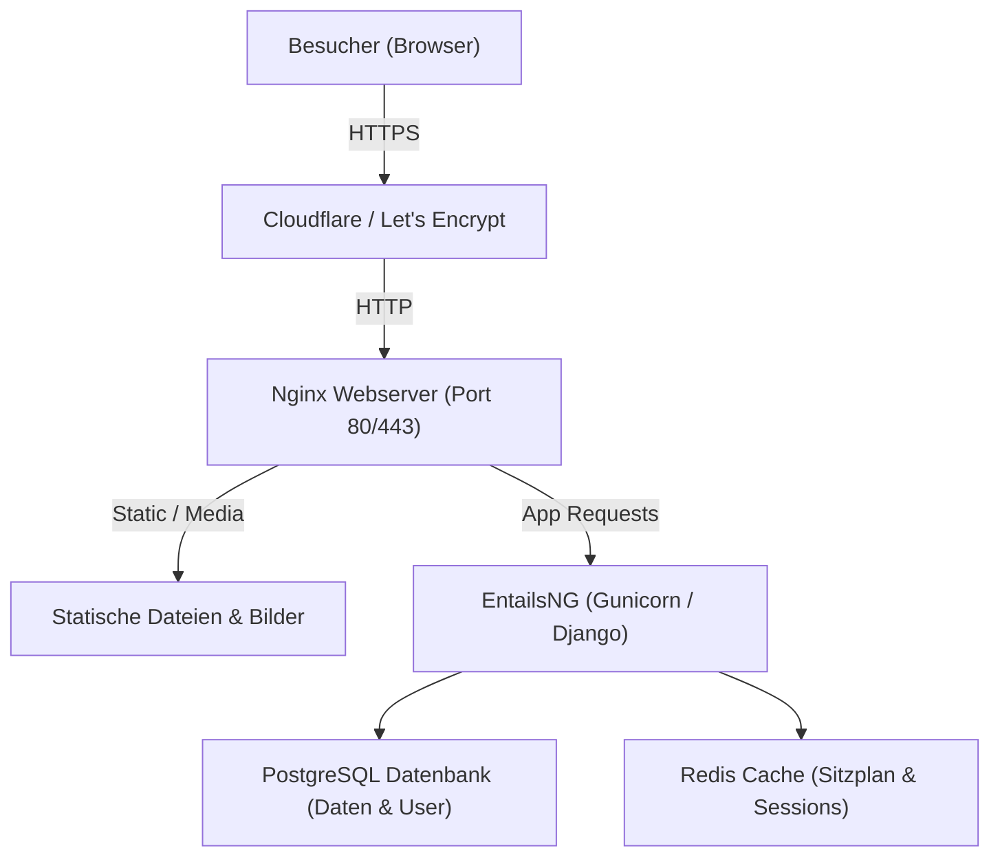

# 📖 Schritt-für-Schritt Deployment-Handbuch für EntailsNG

Willkommen beim offiziellen Deployment-Leitfaden für **EntailsNG**!  
Dieses Handbuch führt dich **von Grund auf** durch die Bereitstellung (Deployment) von **EntailsNG** auf einem Linux-Server (z. B. Ubuntu Server auf einem VPS, einem alten Laptop oder einer virtuellen Maschine).

---

## 🧭 Inhaltsverzeichnis
1. [Die Architektur: Wie EntailsNG funktioniert](#-1-die-architektur-wie-entailsng-funktioniert)
2. [Die 3 Bereitstellungswege im Vergleich](#-2-die-3-bereitstellungswege-im-vergleich)
3. [Schritt 1: Server vorbereiten (Einmalig)](#-schritt-1-server-vorbereiten-einmalig)
4. [Schritt 2: Projekt auf den Server holen](#-schritt-2-projekt-auf-den-server-holen)
5. [Schritt 3: Konfigurationsdatei (.env) befüllen](#-schritt-3-konfigurationsdatei-env-befüllen)
6. [Schritt 4A: Bereitstellung über Cloudflare Tunnel (⭐ Empfohlen für Einsteiger & Heimserver)](#-schritt-4a-bereitstellung-über-cloudflare-tunnel-weg-a)
7. [Schritt 4B: Bereitstellung auf Linux-VPS mit Let's Encrypt (Weg B)](#-schritt-4b-bereitstellung-auf-linux-vps-mit-lets-encrypt-weg-b)
8. [Schritt 4C: Lokale Entwicklung & Offline-Nutzung (Weg C)](#-schritt-4c-lokale-entwicklung--offline-nutzung-weg-c)
9. [Schritt 5: Ersteinrichtung im Admin-Dashboard (Checkliste)](#-schritt-5-ersteinrichtung-im-admin-dashboard-checkliste)
10. [Schritt 6: E-Mail-Versand (SMTP & Warteschlange) einrichten & testen](#-schritt-6-e-mail-versand-smtp--warteschlange-einrichten--testen)
11. [Schritt 7: Vor-Ort Einlass & Helfer Check-in Scanner](#-schritt-7-vor-ort-einlass--helfer-check-in-scanner)
12. [Schritt 8: Datensicherung (Backup) & Wiederherstellung](#-schritt-8-datensicherung-backup--wiederherstellung)
13. [Schritt 9: Updates einspielen](#-schritt-9-updates-einspielen)
14. [Schritt 10: Troubleshooting – Häufige Fehler & Sofortlösungen](#-schritt-10-troubleshooting--häufige-fehler--sofortlösungen)
15. [Spickzettel: Die wichtigsten Befehle & CLI-Tools](#-spickzettel-die-wichtigsten-befehle--cli-tools)

---

## 🧱 1. Die Architektur: Wie EntailsNG funktioniert

EntailsNG nutzt **Docker**. Das bedeutet: Du musst keine Datenbanken, Webserver oder Python-Pakete manuell auf deinem Server installieren – alles läuft isoliert in standardisierten Containern:



* **`web` (Django/Gunicorn):** Das Herzstück der Anwendung.
* **`db` (PostgreSQL):** Sichere Speicherung aller Benutzer, Events, Sitzplätze und Turniere.
* **`redis` (Redis Cache):** Ultraschneller Arbeitsspeicher-Cache für Platzreservierungen und Live-Zähler.
* **`nginx` (Webserver):** Liefert Bilder und CSS aus und leitet Anfragen sicher an Django weiter.
* **`certbot` / `cloudflared`:** Automatische Verschlüsselung (HTTPS / SSL).

---

## ⚖️ 2. Die 3 Bereitstellungswege im Vergleich

| Kriterium | 🟢 Weg A: Cloudflare Tunnel | 🔵 Weg B: Regulärer Linux-VPS | 🟡 Weg C: Lokaler PC / Laptop |
| :--- | :--- | :--- | :--- |
| **Geeignet für** | Heimserver, Mini-PC (z. B. N100/Intel NUC), lokale VM, Laptop | Gemieteter Cloud-Server (Hetzner, Netcup, Strato, DigitalOcean) | Testen & Vorbereitung auf dem eigenen Computer |
| **Portfreigaben im Router** | ❌ **Keine** (Funktioniert hinter Fritz!Box, DS-Lite, CGNAT) | ✔️ Port 80 und 443 müssen offen sein | ❌ Keine |
| **Öffentliche IP nötig?** | ❌ Nein | ✔️ Feste öffentliche IPv4 nötig | ❌ Nein |
| **HTTPS / SSL** | Automatisch via Cloudflare Edge | Automatisch via Let's Encrypt Script | HTTP (Lokal `localhost:8000`) |
| **Sicherheit** | Server-IP bleibt 100% anonym (DDoS-Schutz) | Server-IP ist öffentlich im DNS | Nur lokal erreichbar |

---

## 🛠️ Schritt 1: Server vorbereiten (Einmalig)

Logge dich per SSH auf deinem Linux-Server ein (z. B. Ubuntu Server 22.04 / 24.04 LTS oder Debian 12):

### 1.1 System aktualisieren & Basis-Tools installieren:
```bash
sudo apt update && sudo apt upgrade -y
sudo apt install -y git curl ufw docker.io docker-compose-v2
```

### 1.2 Docker-Berechtigungen für deinen Benutzer setzen:
Damit du Docker ohne `sudo` steuern kannst:
```bash
sudo usermod -aG docker $USER
newgrp docker
```
> *(Test: Führe `docker ps` aus. Es sollte eine leere Tabelle ohne Fehlermeldung erscheinen).*

---

## 📥 Schritt 2: Projekt auf den Server holen

Klone das Repository auf deinen Server:

```bash
# In das Zielverzeichnis klonen:
git clone https://github.com/DEIN_BENUTZERNAME/DEIN_REPO.git /opt/entailsng

# In das Verzeichnis wechseln:
cd /opt/entailsng
```

---

## ⚙️ Schritt 3: Konfigurationsdatei (`.env`) befüllen

Kopiere die Vorlage `.env.example` in eine neue `.env`-Datei:

```bash
cp .env.example .env
nano .env
```

### 📋 Alle Einstellungen im Detail erklärt:

#### 1. Sicherheit & Domain
* **`SECRET_KEY`**: Ein langer, kryptografisch sicherer Zufallsschlüssel für Sessions und CSRF-Tokens.  
  👉 **Befehl zum Generieren:**
  ```bash
  python3 -c "import secrets; print(secrets.token_urlsafe(50))"
  ```
* **`FIELD_ENCRYPTION_KEY`**: Ein zweiter, separater Schlüssel zur sicheren AES-256-Verschlüsselung sensibler Daten in der Datenbank (z. B. das SMTP-Passwort aus den Allgemeinen E-Mail Einstellungen).  
  👉 **Befehl zum Generieren:**
  ```bash
  python3 -c "import secrets; print(secrets.token_urlsafe(50))"
  ```
  > [!IMPORTANT]
  > Setze den `FIELD_ENCRYPTION_KEY` **einmalig vor dem ersten Start** und ändere ihn danach nicht mehr. Er ist unabhängig vom `SECRET_KEY`, sodass der `SECRET_KEY` bei Bedarf gefahrlos rotiert werden kann.

* **`DEBUG`**: Im Produktivbetrieb **immer `False`**! Schützt interne Fehlermeldungen und aktiviert strikte Security-Header (HSTS, Secure Cookies).
* **`DOMAIN_NAME`**: Deine Domain oder Subdomain (z. B. `lan.meinedomain.de`).
* **`ALLOWED_HOSTS`**: Erlaubte Hostnamen, durch Komma getrennt (z. B. `lan.meinedomain.de,localhost,127.0.0.1`).
* **`CSRF_TRUSTED_ORIGINS`**: Deine Domain mit `https://` (z. B. `https://lan.meinedomain.de`).
* **`BEHIND_PROXY`**: Im Docker- und Reverse-Proxy-Betrieb (Nginx / Cloudflare) auf `True` belassen (`HTTP_X_FORWARDED_PROTO: https`).

#### 2. Datenbank (PostgreSQL) & Redis
* **`DB_ENGINE`**: `postgresql` (oder `sqlite` für lokalen Offline-Betrieb)
* **`DB_NAME`**: `entailsng_db` (Name der Datenbank)
* **`DB_USER`**: `entailsng_user` (Benutzername)
* **`DB_PASSWORD`**: Ein starkes, frei erfundenes Passwort (z. B. `MeinGeheimesDBPasswort2026!`).
* **`DB_HOST`**: `db` (im Docker-Netzwerk) bzw. `127.0.0.1` (bei direktem Host-Betrieb)
* **`DB_PORT`**: `5432`
* **`REDIS_URL`**: `redis://redis:6379/1` (für Multi-Worker-Konsistenz und Sitzplatzreservierungen)

#### 3. E-Mail Warteschlange (Asynchroner Versand)
* **`EMAIL_ASYNC_QUEUE`**: Standardmäßig `True`. E-Mails (Tickets, Verifizierungen) werden non-blocking in einer DB-Warteschlange abgelegt und blockieren den Web-Request des Nutzers nicht.

#### 4. Speichern in `nano`:
* Drücke `Strg` + `O`, dann `Enter` (Speichern).
* Drücke `Strg` + `X` (Beenden).

---

## 🟢 Schritt 4A: Bereitstellung über Cloudflare Tunnel (Weg A)

*(Die einfachste und sicherste Methode für Heimserver, Mini-PCs, DSL-Anschlüsse und lokale VMs).*

### 1. Tunnel im Cloudflare Dashboard anlegen:
1. Öffne das [Cloudflare Zero Trust Dashboard](https://one.dash.cloudflare.com/) → **Networks** → **Tunnels**.
2. Klicke auf **Add a tunnel** → Wähle **Cloudflared** → Name vergeben (z. B. `entailsng`) → **Save tunnel**.
3. Wähle als Installationsumgebung **Docker**. Kopiere den langen Token (beginnt mit `eyJhIj...`).
4. Öffne deine `.env` auf dem Server (`nano .env`) und trage den Token ein:
   ```env
   CLOUDFLARE_TUNNEL_TOKEN=eyJhIjoi...
   ```
5. Klicke im Cloudflare Dashboard auf **Next** und richte den **Public Hostname** ein:
   * **Subdomain:** z. B. `lan` (oder leer lassen für die Hauptdomain)
   * **Domain:** Wähle deine Domain aus
   * **Type:** `HTTP`
   * **URL:** `nginx:80`
6. Klicke auf **Save hostname**.
7. Stelle unter *Cloudflare Dashboard* → *Deine Domain* → *SSL/TLS* die Verschlüsselung auf **Full** (oder **Full (strict)**).

> [!TIP]
> **Tipp für Heimserver mit Pi-hole oder bestehendem Webserver:**
> Falls Port 80 oder 443 auf deinem Heimserver bereits belegt ist, kannst du in deiner `.env` einfach Ausweichports angeben (z. B. `HTTP_PORT=8080` und `HTTPS_PORT=8443`). Der Cloudflare Tunnel verbindet sich containerintern trotzdem direkt über Port 80 mit Nginx!

### 2. Container mit Tunnel starten:
```bash
docker compose --profile tunnel up -d --build
```

Fertig! Nginx startet dank intelligenter Proxy-Erkennung und integriertem Fallback-Zertifikat sofort und ohne Redirect-Schleifen. Deine LAN-Party-Webseite ist jetzt weltweit unter `https://lan.meinedomain.de` erreichbar.

---

## 🔵 Schritt 4B: Bereitstellung auf Linux-VPS mit Let's Encrypt (Weg B)

### 1. DNS A-Record setzen:
Erstelle bei deinem Domainanbieter einen **A-Record**, der auf die öffentliche IP-Adresse deines Servers zeigt:
* `lan.meinedomain.de` $\rightarrow$ `123.45.67.89`

### 2. Firewall konfigurieren:
```bash
sudo ufw allow 22/tcp
sudo ufw allow 80/tcp
sudo ufw allow 443/tcp
sudo ufw enable
```

### 3. SSL-Zertifikat automatisch ausstellen & Stack starten:
```bash
bash nginx/init-letsencrypt.sh
```
Das Skript erstellt die Zertifikate automatisch, bindet sie ein und startet alle Container inklusive automatischer Zertifikatserneuerung.

---

## 🟡 Schritt 4C: Lokale Entwicklung & Offline-Nutzung (Weg C)

Für lokales Testen oder Vor-Ort-Betrieb in einer Halle ohne Internetverbindung:

* **100% Offline-fähig:** EntailsNG benötigt im Betrieb keinen Internetzugang. Alle Schriften (*Inter* und *JetBrains Mono*) sind als WOFF2 direkt unter `/static/fonts/` lokal im Projekt abgelegt (keine Abrufe von Google Fonts). Auch QR-Codes und Tickets werden rein server- bzw. clientseitig erzeugt.
* **Automatische Datenbank-Erkennung:** `start.sh` und `install.sh` prüfen automatisch, ob PostgreSQL und Redis laufen (oder starten sie via Podman/Docker). Falls keine Container-Engine vorhanden ist, wird nahtlos die integrierte SQLite-Entwicklungsdatenbank genutzt.

```bash
# 1. Setup ausführen (einmalig; optional mit Flag '--demo' für Test-Events, Sitzplan & Accounts)
./install.sh --demo

# 2. Server starten (prüft automatisch Pakete & Datenbank)
./start.sh
```
Rufe im Browser auf: `http://127.0.0.1:8000/`  
*(Der Helfer Check-in Scanner steht unter `http://127.0.0.1:8000/checkin/scanner/` bereit).*

---

## 👤 Schritt 5: Ersteinrichtung im Admin-Dashboard (Checkliste)

Sobald die Container laufen, führe folgende Schritte durch:

### 1. Administrator-Konto erstellen:
Frische Installationen starten aus Sicherheitsgründen standardmäßig mit einer sauberen, leeren Datenbank ohne Testbenutzer. Lege daher dein persönliches Administrator-Konto an:
```bash
docker compose exec web python manage.py createsuperuser
```
Gib deinen gewünschten Benutzernamen, E-Mail-Adresse und ein Passwort ein.

> [!NOTE]
> Falls du stattdessen für einen schnellen Test vorbereitete Demo-Accounts (`admin`, `orga`, `gamer1`, `gamer2` mit Kennwort `EntailsDemo2026!`) laden möchtest, führe einfach aus:
> `docker compose exec web python manage.py loaddata initial_data.json`

### 2. Im Admin-Bereich einloggen:
Öffne `https://deine-domain.de/admin/` und melde dich an.

### 3. Checkliste für die Event-Vorbereitung:
- [ ] **Hauptveranstaltung anlegen (`Veranstaltungen`):**
  - Titel, Start- und Endzeitpunkt, max. Teilnehmerzahl und Ticketpreis eintragen.
  - Das Häkchen bei **Ist aktiv** setzen (es kann immer genau eine aktive Hauptveranstaltung geben).
- [ ] **Ticketkategorien anlegen (`Ticket-Kategorien`):**
  - z. B. *Standard Ticket (30,00 €)*, *Clan-Ticket*, *VIP / Sponsor*.
- [ ] **Sitzplan erstellen (`Sitzpläne`):**
  - Klicke auf **Sitzplan-Editor öffnen**, wähle Spalten und Zeilen (z. B. 20x15) und zeichne Tische, Gänge, Bühne und Catering-Bereiche ein.
- [ ] **Zahlungsdaten hinterlegen (`Allgemeine Einstellungen`):**
  - **Kontoinhaber** & **IBAN** (sowie optional BIC) eintragen.
  - EntailsNG erzeugt für jeden Gast auf dem Dashboard automatisch den genormten **EPC-QR-Code (GiroCode)** nach EPC069-12-Standard. Banking-Apps (Sparkasse, VR-Banken, DKB, ING, N26 etc.) übernehmen Betrag, IBAN und den 8-stelligen Buchungscode fehlerfrei per Kamerascan.
- [ ] **Design & Branding (`Webseiten-Anpassungen`):**
  - Eigenes Logo hochladen, Farbschema wählen (*Default Cyan*, *Warm Amber*, *Emerald Green*, *Cyberpunk Purple* oder *Slate Blue*).
  - UI-Skalierung wählen (*Kompakt 90%*, *Standard 100%*, *Groß 110%*) sowie optional Custom-CSS hinterlegen (integrierte Syntax-Validierung schützt vor Layout-Fehlern).
- [ ] **Rechtliches & Datenschutz (`Rechtliche Hinweise`):**
  - Impressum und Datenschutzerklärung hinterlegen (Rich-Text Editor). Der integrierte Cookie-Hinweis informiert Besucher transparent über technisch notwendige Session-Cookies.
- [ ] **Sicherer Demo-Reset (`/admin/demo-reset/`):**
  - Falls Test-Daten geladen wurden, kann die Datenbank im Admin-Bereich mit einem Klick auf die Standard-Demodaten zurückgesetzt werden. Dieser Endpunkt ist aus Sicherheitsgründen strikt auf Superuser beschränkt.

---

## ✉️ Schritt 6: E-Mail-Versand (SMTP & Warteschlange) einrichten & testen

EntailsNG versendet E-Mail-Verifizierungscodes, Buchungsbestätigungen, Tickets und Passwort-Reset-Mails.

### 1. Empfohlene SMTP-Anbieter:
* **Resend** (sehr modern, 3.000 Mails/Monat kostenlos)
* **Brevo / Sendinblue** (300 Mails/Tag kostenlos)
* **Eigener Webhoster** (z. B. Hetzner, Strato, All-Inkl)

### 2. Im Admin-Bereich konfigurieren:
1. Öffne im Django-Admin den Menüpunkt **Allgemeine E-Mail Einstellungen**.
2. Wähle den gewünschten Versandweg:
   - **Eigener SMTP-Server:** Hostname, Port (z. B. `587` mit TLS oder `465` mit SSL), Benutzername und Passwort eintragen.
3. Klicke auf **Verbindung testen**.
4. Wenn der Test erfolgreich ist: Schalter **Gäste erhalten E-Mails** aktivieren.

### 3. Asynchrone Warteschlange (E-Mail Queue):
Um Seitenladezeiten im Browser zu minimieren, werden E-Mails standardmäßig asynchron in eine Datenbank-Warteschlange eingereiht (`EMAIL_ASYNC_QUEUE=True`) und im Hintergrund versendet.
```bash
# Warteschlange manuell anstoßen / abarbeiten:
docker compose exec web python manage.py process_mail_queue
```

### 4. Diagnose-Tool ausführen:
```bash
# E-Mail-Gesundheitscheck:
docker compose exec web python manage.py email_doctor

# Mit echtem Testversand an deine Adresse:
docker compose exec web python manage.py email_doctor --send-to deine@email.de
```

---

## 📱 Schritt 7: Vor-Ort Einlass & Helfer Check-in Scanner

Für den Einlass am Empfang deiner LAN-Party bietet EntailsNG ein spezialisiertes, schnelles Einlass-Werkzeug.

### 1. Aufruf & Berechtigung:
* **URL:** `https://deine-domain.de/checkin/scanner/` (oder lokal `http://127.0.0.1:8000/checkin/scanner/`)
* **Zugriff:** Für alle Benutzerkonten mit Mitarbeiter-Status (`is_staff=True` bzw. Helfer/Orga-Rolle).
* **Teilnehmer:** Gäste finden ihren persönlichen Einlass-QR-Code und Ticket-Code direkt auf ihrem Dashboard (`/dashboard/`).

### 2. Die 3 flexiblen Einlass-Methoden:
1. **📷 Integrierter Kamera-Scan:**
   - Helfer öffnen die Scanner-Seite auf ihrem Smartphone, Tablet oder Laptop mit Webcam und klicken auf **Kamera Starten**.
   - Erkennt Ticket-QR-Codes (vom Handy-Display des Gasts oder Ausdruck) in Sekundenbruchteilen mit sofortigem visuellem & akustischem Signal (Erfolg/Warnung/Fehler).
2. **⌨️ Hardware-Handscanner (USB / Bluetooth):**
   - Unterstützt handelsübliche 2D-Barcode-Scanner (Tastatur-Emulation). Der Code wird automatisch in das manuelle Eingabefeld fokussiert und mit `[Enter]` sofort eingecheckt.
3. **🔍 Live-Teilnehmerliste & Schnellsuche:**
   - Echtzeit-Suche nach Benutzername, echtem Namen, Tischnummer (z. B. `A-12`) oder Ticket-Code.
   - Filter nach Status (*Noch nicht da*, *Bereits eingecheckt*, *Unbezahlt*).
   - Drücken der `[Enter]`-Taste checkt automatisch den obersten Treffer der Liste ein.

### 3. Sicherheitsprüfungen beim Einlass:
* **Altersverifikation:** Zeigt Helfern das Geburtsdatum und eventuelle Ausweis-Pflichten für FSK16/FSK18-Bereiche an (`can_check_in()`).
* **Bezahlstatus:** Warnt optisch rot, wenn ein Ticket noch nicht bezahlt ist (vor Ort Nachzahlung möglich).
* **Double-Checkin Schutz:** Verhindert das versehentliche mehrfache Einchecken desselben Tickets.

---

## 💾 Schritt 8: Datensicherung (Backup) & Wiederherstellung

### 1. Backup erstellen (Dauert 5 Sekunden):
```bash
# 1. Datenbank sichern (in Datei mit aktuellem Datum speichern):
docker compose exec -T db pg_dump -U entailsng_user entailsng_db > backup_$(date +%Y%m%d_%H%M%S).sql

# 2. Uploads & Konfiguration sichern:
tar -czf media_backup_$(date +%Y%m%d).tar.gz media/ .env
```

### 2. Backup wiederherstellen (Disaster Recovery):
```bash
# Datenbank aus SQL-Datei wiederherstellen:
cat backup_20260901_120000.sql | docker compose exec -T db psql -U entailsng_user entailsng_db
```

---

## 🔄 Schritt 9: Updates einspielen

Wenn es neue Versionen oder Verbesserungen von EntailsNG gibt:

```bash
cd /opt/entailsng

# 1. Neuesten Code abrufen:
git pull

# 2. Container neu bauen & starten (Migrationen laufen automatisch):
docker compose up -d --build
```
> *(Deine Datenbank, hochgeladene Logos und Einstellungen bleiben dabei zu 100% erhalten!)*

---

## 🩺 Schritt 10: Troubleshooting – Häufige Fehler & Sofortlösungen

### ❌ Problem 1: `container entailsng_web is unhealthy`
* **Ursache:** Die Datenbank war beim Start noch nicht ganz bereit oder der Healthcheck hat keine Antwort erhalten.
* **Lösung:** Prüfe die Logs mit:
  ```bash
  docker compose logs -f web
  ```

### ❌ Problem 2: `CSRF verification failed / 403 Forbidden beim Login`
* **Ursache:** Die in `.env` eingetragene URL bei `CSRF_TRUSTED_ORIGINS` stimmt nicht exakt mit der im Browser aufgerufenen Adresse überein.
* **Lösung:** Prüfe in der `.env`:
  ```env
  CSRF_TRUSTED_ORIGINS=https://deine-echte-domain.de
  ```
  *(Achte auf `https://` und eventuelle Subdomains wie `lan.`)*.

### ❌ Problem 3: `E-Mail-Versand schlägt fehl / Port 587 Timeout`
* **Ursache:** Viele Cloud-Hoster (z. B. Hetzner, DigitalOcean) sperren Port 587 für Neukunden standardmäßig gegen Spam.
* **Lösung:** 
  1. Nutze Port `465` mit SSL (`EMAIL_PORT=465`, `EMAIL_USE_SSL=True`).
  2. Oder nutze Resend auf Port `2587`.
  3. Prüfe die Diagnose mit `docker compose exec web python manage.py email_doctor`.

### ❌ Problem 4: `FATAL: password authentication failed for user`
* **Ursache:** Das Passwort in der `.env` wurde nachträglich geändert, aber das bestehende PostgreSQL-Volume enthält noch das alte Passwort.
* **Lösung:** Entweder in der `.env` das alte Passwort wieder eintragen, oder (falls noch keine echten Daten existieren) das Volume zurücksetzen:
  ```bash
  docker compose down -v
  docker compose up -d
  ```

---

## 📋 Spickzettel: Die wichtigsten Befehle & CLI-Tools

| Was möchtest du tun? | Befehl mit Docker | Befehl ohne Docker (lokal) |
| :--- | :--- | :--- |
| **Status aller Container** | `docker compose ps` | – |
| **Live-Logs verfolgen** | `docker compose logs -f web` | Im Terminal von `./start.sh` |
| **Administrator anlegen** | `docker compose exec web python manage.py createsuperuser` | `python manage.py createsuperuser` |
| **System-Seeds einspielen** | `docker compose exec web python manage.py seed_translations` | `python manage.py seed_translations` |
| **Feature-Flags seeden** | `docker compose exec web python manage.py seed_features` | `python manage.py seed_features` |
| **Mail-Vorlagen seeden** | `docker compose exec web python manage.py seed_email_templates` | `python manage.py seed_email_templates` |
| **Mail-Queue abarbeiten** | `docker compose exec web python manage.py process_mail_queue` | `python manage.py process_mail_queue` |
| **E-Mail-Diagnose / Test** | `docker compose exec web python manage.py email_doctor` | `python manage.py email_doctor` |
| **Sicherheits-Check** | `docker compose exec web python manage.py check --deploy` | `python manage.py check --deploy` |
| **Server neu starten** | `docker compose restart` | `./start.sh` neu ausführen |
| **Server stoppen** | `docker compose down` | `Strg + C` |
| **Update durchführen** | `git pull && docker compose up -d --build` | `git pull && ./start.sh` |


