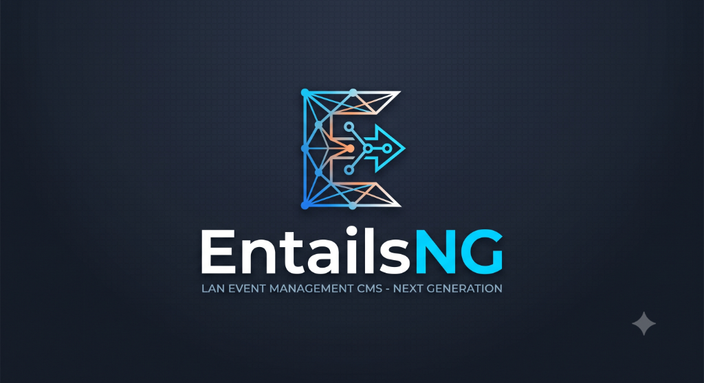

<p align="center">
  
</p>

# 🚀 EntailsNG – LAN Event Management CMS (Next Generation)

Willkommen bei **EntailsNG**, der modernen Neuauflage des LAN-Party-Managementsystems für Community-Treffen, Esports-Events und LAN-Partys mit bis zu 1.000 Gästen!

Dieses Repository wurde so vorbereitet, dass auch **weniger IT-affine Kolleginnen und Kollegen** den aktuellen MVP-Stand in weniger als einer Minute installieren, testen und präsentieren können.

---

## ✨ Neue Highlights & Features im MVP

* 🎨 **System-Individualisierbarkeit & Preset Themes:**
  - Vordefinierte Farb-Themes (*Warm Amber*, *Cyberpunk Neon*, *Slate Blue*, *Emerald Gaming*) oder eigene Custom-Farben.
  - Logo-Upload (PNG, SVG, WebP) für flexibles Branding.
  - Rechtstexte (Impressum & Datenschutz) direkt im Backend pflegbar.
  - Benutzerdefiniertes CSS per Backend injizierbar.
* 📏 **Globales UI-Skalierungssystem (`UIScale`):**
  - Einheitliche Steuerung aller Schriftgrößen, Abstände, Buttons, Formulare & Cards im gesamten Frontend.
  - Stufen im Backend einstellbar: *Sehr klein*, *Klein*, *Mittel (Default)*, *Groß*, *Sehr groß*.
* 📱 **Mobile Responsive & Mobile Top-Header Bar:**
  - Sticky Top-Header auf Mobilgeräten (< 860px) inkl. App-Style Bottom-Navigation.
* 🎟️ **Erweiterter Event-Ende-Status (`expired_ticket_mode`):**
  - **Modus "Ticket abgenutzt":** Das Ticket bleibt mit entwertetem Look (`BEENDET` Stempel, Sepia/Rot-Design) als Erinnerung sichtbar.
  - **Modus "Event beendet":** Das Ticket blendet sich bei Überschreitung des Enddatums automatisch aus.
* 🌐 **100% Backend-Übersetzbar (`SystemTranslation`):**
  - Sämtliche Texte im Frontend können ohne Code-Änderungen über den Admin-Bereich verwaltet werden.

---

## 💡 Warum eine virtuelle Umgebung (`.venv`) sinnvoll ist


Eine **virtuelle Umgebung** (Virtual Environment) erstellt einen isolierten "Sandkasten" für Python. Das bietet folgende Vorteile:

* 🛡️ **Keine Konflikte:** Alle benötigten Bibliotheken (Django, TinyMCE etc.) werden nur in diesen Projektordner installiert, ohne das globale Betriebssystem zu verändern.
* 🔄 **Saubere Installation:** Sollte etwas schiefgehen, kann der Ordner `.venv` einfach gelöscht und mit einem Befehl neu angelegt werden.
* 📦 **Identische Umgebung:** Alle Entwickler und Tester arbeiten exakt mit denselben Paketversionen.

---

## ⚡ Einrichtungsanleitung (Nach Betriebssystem aufgeteilt)

### 🐧 Für Linux-User (Fedora / Ubuntu / Debian)

#### Option 1: Automatisch (1-Klick Setup)
Öffne ein Terminal im Projektordner und führe aus:
```bash
./install.sh          # Saubere Installation (ohne Testdaten für Produktion)
# ODER:
./install.sh --demo   # Installation mit Test-Events & Demo-Benutzern

./start.sh            # Server starten
```

#### Option 2: Manuell im Terminal
```bash
# 1. Virtuelle Umgebung anlegen & aktivieren
python3 -m venv .venv
source .venv/bin/activate

# 2. Abhängigkeiten installieren
pip install -r requirements.txt

# 3. Datenbank strukturieren, System-Keys initialisieren & Server starten
python manage.py migrate
python manage.py seed_translations
python manage.py seed_features
# Optional: python manage.py loaddata initial_data.json  (nur für Demo-Daten)
python manage.py runserver
```

---

### 🪟 Für Windows-User (PowerShell / Eingabeaufforderung)

#### Manuelle Einrichtung in der PowerShell:
```powershell
# 1. Virtuelle Umgebung anlegen
python -m venv .venv

# 2. Virtuelle Umgebung aktivieren
.venv\Scripts\Activate.ps1
# (Falls Eingabeaufforderung / CMD genutzt wird: .venv\Scripts\activate.bat)

# 3. Abhängigkeiten installieren
pip install -r requirements.txt

# 4. Datenbank strukturieren & Server starten
python manage.py migrate
python manage.py seed_translations
python manage.py seed_features
# Optional für Demo-Daten: python manage.py loaddata initial_data.json
python manage.py runserver
```

---

## 🌐 Aufrufen der Seiten im Web-Browser

Sobald der Server gestartet ist, öffne deinen Internet-Browser (z. B. Chrome, Firefox, Edge oder Safari) und rufe folgende Links auf:

| Bereich | Web-Adresse (URL) | Beschreibung |
| :--- | :--- | :--- |
| **🌐 Hauptseite / Dashboard** | [http://127.0.0.1:8000/](http://127.0.0.1:8000/) | Hauptübersicht mit aktuellem Event, Ticket-Status, News & Saalplan-Vorschau. |
| **🗺️ Interaktiver Sitzplan** | [http://127.0.0.1:8000/seating/](http://127.0.0.1:8000/seating/) | 2D-Saalplan mit Zoom & Verschieben (Performance-optimiert für bis zu 1.000 Plätze). |
| **📱 Helfer Check-in Scanner** | [http://127.0.0.1:8000/checkin/scanner/](http://127.0.0.1:8000/checkin/scanner/) | Vor-Ort Einlass-Tool für Helfer mit Kamera-QR-Scan & Ton-Feedback *(Nur für Mitarbeiter)*. |
| **🛠️ Admin-Verwaltung** | [http://127.0.0.1:8000/admin/](http://127.0.0.1:8000/admin/) | Django Verwaltungsoberfläche für Events, Sitzpläne, E-Mail-Konfiguration & User. |

---

## 🔑 Voreingestellte Test-Zugänge (Nur bei `--demo` Installation)

Falls die Installation mit `./install.sh --demo` ausgeführt wurde, sind folgende Demo-Accounts verfügbar:

* **Administrator / Helfer Account**:
  * **Benutzername:** `sadmin`
  * **Passwort:** `adminpwd`
  * *(Besitzt Mitarbeiter-Rechte für den Helfer-Scanner und den Admin-Bereich)*

* **Normaler Teilnehmer / Spieler Account**:
  * **Benutzername:** `gamer1`
  * **Passwort:** `guestpwd`

> ⚠️ **Sicherheitshinweis für den Live-Betrieb:** Bei einer regulären Installation ohne `--demo` müssen eigene Administratoren sicher über `python manage.py createsuperuser` angelegt werden. Ändere vor dem Live-Betrieb stets den `SECRET_KEY` und die Datenbankpasswörter in deiner `.env`-Datei.


---

## 🐳 Docker & Produktions-Betrieb

EntailsNG bietet ein produktionsbereites Docker-Setup mit PostgreSQL, Redis und WhiteNoise.

### 1. Konfigurationsdatei `.env` erstellen:
Kopiere die Vorlage `.env.example` nach `.env` und passe deine Einstellungen an:
```bash
cp .env.example .env
```

Wichtige Produktions-Variablen:
* **`SECRET_KEY`**: *(Pflicht bei `DEBUG=False`)* – Generiere einen sicheren, zufälligen Schlüssel (z. B. via `openssl rand -hex 32` oder `python -c "import secrets; print(secrets.token_urlsafe(50))"`).
* **`DEBUG`**: Für den Live-Betrieb auf `False` setzen.
* **`ALLOWED_HOSTS`**: Deine Domain(s) kommagetrennt (z. B. `lan.meinedomain.de,127.0.0.1`).
* **`CSRF_TRUSTED_ORIGINS`**: Deine HTTPS-Domain(s) (z. B. `https://lan.meinedomain.de`).
* **`REDIS_URL`**: `redis://redis:6379/1` *(Empfohlen in Produktion)* – Zentraler Cache für Multi-Worker-Betrieb (z. B. Gunicorn), damit Theme- und Navigations-Invalidierungen sofort auf allen Workern greifen.
* **`SESSION_COOKIE_SECURE` / `CSRF_COOKIE_SECURE`**: Standardmäßig `True` bei `DEBUG=False` für HTTPS-Verbindungen.

### 2. Docker Compose starten:
```bash
docker compose up -d
```

### 3. Initiale Migrationen & Admin anlegen:
```bash
docker compose exec web python manage.py migrate
docker compose exec web python manage.py seed_translations
docker compose exec web python manage.py seed_features
docker compose exec web python manage.py createsuperuser
```

---

## 🛑 Lokalen Server beenden
Um den lokalen Entwicklungsserver wieder zu beenden, gehe zurück in das Terminal-Fenster und drücke gleichzeitig die Tasten **`[STRG]` + `[C]`**.

