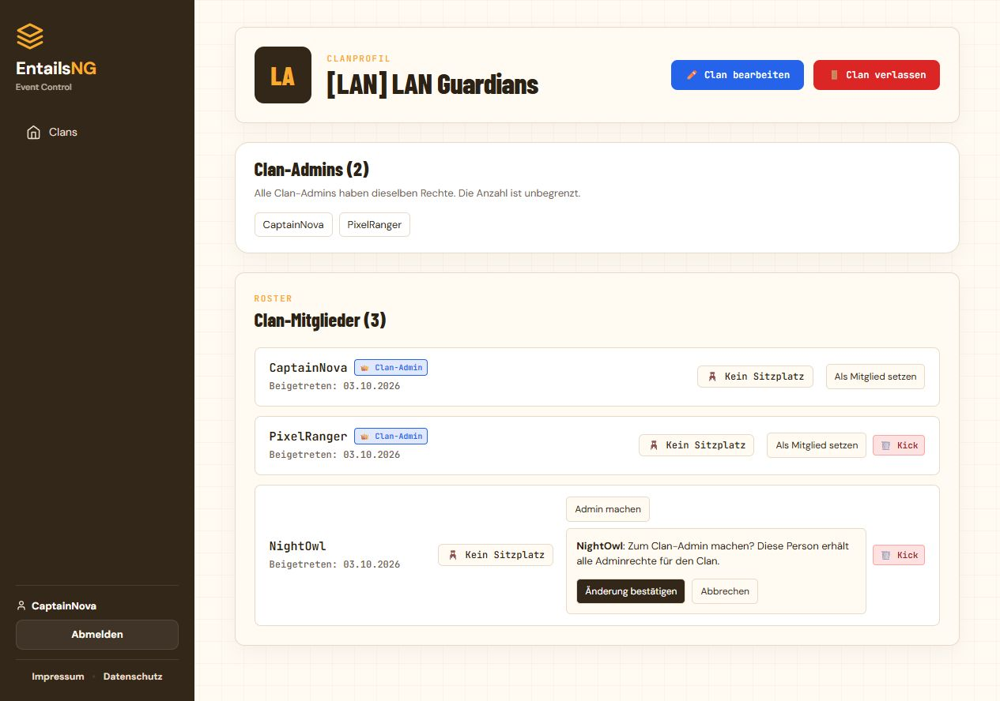

# Clan-Admins verwalten

Stand: 3. Oktober 2026.

Ein Clan kann beliebig viele gleichberechtigte Admins haben. Im Clanprofil zeigt
die neue Übersicht Namen und Anzahl der aktiven, bestätigten Admins.

## Bedienung

- Ein Clan-Admin öffnet beim gewünschten Mitglied **Admin machen** und bestätigt
  die Änderung. Nur bestätigte Mitglieder mit aktivem, nicht gelöschtem Konto
  können Adminrechte erhalten.
- **Als Mitglied setzen** entzieht die Adminrolle nach einer Bestätigung. Die
  Mitgliedschaft und das Beitrittsdatum bleiben erhalten. Auch die eigene Rolle
  kann geändert werden, wenn ein weiterer aktiver Admin vorhanden ist.
- **Abbrechen** schließt die Bestätigung ohne Änderung. Erfolg und Fehler werden
  nach einer Aktion im Clanprofil angezeigt.
- Der letzte aktive Admin kann nicht herabgestuft werden. Ein deaktiviertes
  Adminkonto zählt dabei nicht als Ersatz. Die Oberfläche erläutert die Sperre;
  der Server prüft sie auch bei direkt gesendeten oder veralteten Formularen.
- Beim Austritt des letzten Admins übernimmt das älteste verbleibende aktive,
  bestätigte Mitglied. Gibt es nur deaktivierte Restmitglieder, wird der Austritt
  abgewiesen; zuerst ein Mitglied aktivieren beziehungsweise einen weiteren
  aktiven Admin bestimmen. Der Austritt des letzten Mitglieds löst den Clan wie
  bisher auf. Die Kontolöschung bevorzugt ebenfalls einen aktiven Nachfolger.

Die Verwaltung ist Teil des Clanprofils; zusätzliche Rollen oder ein separates
Admin-Limit werden nicht benötigt. Clan-Admins dürfen auch andere Clan-Admins
herabstufen. Diese Regel entspricht ihren gleichen Rechten.



## Implementierung

`clans/services.py` bündelt Rollenänderungen, Entfernung, Bearbeitungsrechte,
Beitrittsentscheidungen und Austritt. Schreibzugriffe laufen atomar mit Sperren
in der Reihenfolge **Benutzer nach ID → Clan → Mitgliedschaft**. Nach Wartezeiten
werden Berechtigungen, Mitgliedsstatus und Zielkonto erneut geprüft. Die
Clan-Sperre wird auch bei der bestehenden Kontolöschung verwendet. Dadurch
werden Rollenänderungen und die Vergabe eines Nachfolgers serialisiert.

Der Beitritts-Endpunkt verarbeitet ausschließlich offene Anfragen. Er darf keine
bereits bestätigten Mitgliedschaften entfernen oder Adminrechte über eine
frühere Anfrage vergeben. Angenommene Anfragen erhalten immer die Mitgliedsrolle.

Die Bestätigung nutzt native `details`-Elemente und funktioniert ohne JavaScript.
Alle Schreibaktionen verlangen POST und unterliegen dem bestehenden CSRF-Schutz;
Rollenformulare senden zusätzlich `confirmed=1`. Neue Systemtexte stehen in
`clans/texts.py`, werden in `DEFAULT_TEXTS` eingebunden und sind über
`SystemTranslation` konfigurierbar. `static/css/clans.css` passt die Oberfläche
auch an schmale Ansichten an.

Die beschriebenen Regeln gelten für die Selbstverwaltung über das Clanprofil.
Direkte Datenbankänderungen und die allgemeine Django-Administration sind
weiterhin Werkzeuge der Betreiber und müssen konsistente Clanrollen erhalten.

## Prüfung und Einführung

SQLite-Regression mit deaktivierter HTTPS-Umleitung für den lokalen Testclient:

```powershell
$env:DB_ENGINE = 'sqlite'
$env:SECURE_SSL_REDIRECT = 'False'
python manage.py test clans users.test_account_deletion tournaments.test_recruitment --noinput
```

Der Lauf benötigt wie üblich `SECRET_KEY` und `ALLOWED_HOSTS` in der Umgebung.
Ergebnis: **113 Tests, 101 erfolgreich, 12 PostgreSQL-Fälle auf SQLite
übersprungen**, keine Fehler. Darin enthalten: 24 neue Funktionstests und sieben
neue Paralleltests. Die Paralleltests sind im vorhandenen PostgreSQL-CI-Job
eingetragen; sie wurden lokal nicht gegen PostgreSQL ausgeführt.

Im Browser wurden Beförderung, Herabstufung, Abbrechen, Adminanzahl und der Schutz
des letzten Admins mit lokalen Testkonten geprüft. Die 390-Pixel-Ansicht zeigt
keinen horizontalen Überlauf. Screenshots liegen unter `docs/screenshots/clan-admins-*`.
Der Clan-Migrationscheck meldet keine Änderungen.

Für die Einführung sind **`python manage.py seed_translations`** und
**`python manage.py collectstatic --noinput`** erforderlich. Diese Erweiterung
benötigt keine Datenbankmigration.
