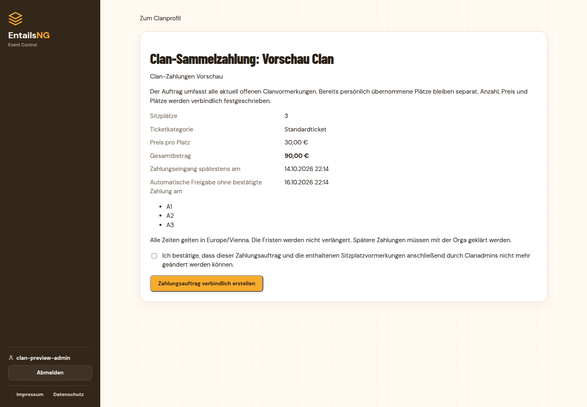
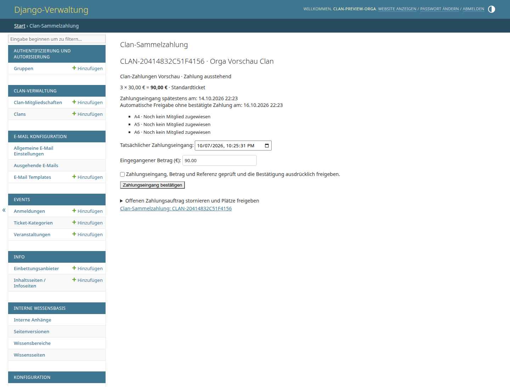
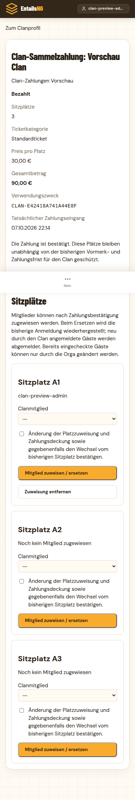

# Clan-Sammelzahlungen

Stand: 7. Oktober 2026. Ergänzung zu [Clan-Sitzplatzvormerkungen](clan-seat-holds.md).

## Bedienung

Im Clanprofil und in der Clan-Sitzplatzauswahl öffnet **Clan-Sammelzahlung und
Plätze verwalten** die Übersicht. Ein Clanadmin kann einen Zahlungsauftrag für
**alle aktuell offenen, noch nicht persönlich übernommenen Vormerkungen** des
Clans erstellen. Das Maximal-Kontingent wird nicht berechnet: Drei offene Plätze
zu 30 € ergeben einen Auftrag über 90 €, auch bei einem Kontingent von acht.
Persönlich übernommene Plätze und ihre Einzelzahlungen bleiben separat erhalten.

Die Vorschau zeigt Plätze, Ticketkategorie, Einzelpreis, Gesamtbetrag und beide
Fristen. Vor Erstellung bestätigt der Admin ausdrücklich die Unveränderbarkeit.
Anschließend sind Anzahl, Plätze, Preis, Ticketkategorie, Bankdaten und
Verwendungszweck festgeschrieben. Auch weitere Clanadmins können die Auswahl
nicht ändern. Es gibt einen Auftrag pro Clan und Veranstaltung; ein stornierter
Auftrag bleibt als Historie bestehen und kann nicht erneut erstellt werden.

Die Übersicht zeigt die Bankdaten und einen lokal erzeugten GiroCode. Der
Clanadmin führt die Überweisung selbst aus; die Plattform löst keine Bankzahlung
aus. Bankdaten und Zahlungsübersicht sind ausschließlich für Clanadmins und
berechtigte Orgas erreichbar. Der öffentliche Sitzplan zeigt lediglich
**Clan-Zahlung ausstehend** oder **Clanplatz bezahlt** mit Clanname/Logo.



## Ticketkategorie und feste Fristen

Unter **Konfiguration → Clan Sitzplatz Vormerkung** stehen zusätzlich:

- **Ticketkategorie für Clan-Sammelzahlungen**: Bei genau einer aktiven
  Ticketkategorie der Veranstaltung wird diese automatisch gewählt. Bei mehreren
  Kategorien muss die Orga eine aktive Kategorie dieser Veranstaltung festlegen.
  Bei einer neuen Veranstaltung gegebenenfalls neu auswählen. Kostenlosen
  Kategorien wird kein Überweisungsauftrag zugeordnet.
- **Zahlungsfrist in Tagen**: Standard sieben Kalendertage.
- **Prüfzeit für die Orga in Tagen**: Standard zwei Kalendertage.

Die Fristen gelten in `Europe/Vienna`, einschließlich Zeitumstellung, und werden
bereits in der bestätigten Vorschau gespeichert. Die Vorschau ist 15 Minuten
gültig. Zahlungseingang und automatische Freigabe erscheinen als konkrete
Zeitpunkte. Änderungen am Auftrag verlängern die Frist nicht.

Der Zeitraum endet spätestens mit der ursprünglichen Vormerkfrist oder dem
Eventende. Beispiel: Bei nur fünf verbleibenden Tagen und zwei Tagen Prüfzeit
bleiben drei Tage für den Zahlungseingang. Bleibt nur Prüfzeit, wird kein Auftrag
erstellt. Nach Ende der Zahlungsfrist verschwindet der GiroCode; die Oberfläche
bittet ausdrücklich darum, keine neue Überweisung mehr zu tätigen. Innerhalb
der Prüfzeit kann die Orga einen rechtzeitig eingegangenen Betrag bestätigen.

Nach Ende der Prüfzeit werden unbestätigte Aufträge storniert und ihre Plätze
freigegeben. Der bestehende `process_clan_seat_holds`-Worker verarbeitet auch
Sammelzahlungen. Sitzplatzschutz und reservierte Teilnehmerkapazität enden bereits
zum festen Zeitpunkt, auch wenn der Worker vorübergehend nicht läuft; die
gespeicherte Stornierung und ihre Benachrichtigung folgen beim nächsten Durchlauf.
Absage, Abschluss und Deaktivierung des Events stornieren offene Aufträge.
Bestätigte Aufträge bleiben für die Historie erhalten.

## Zahlung bestätigen

Im Backend unter **Sitzplan → Clan Sammelzahlungen** öffnet **Zahlungsauftrag
bestätigen oder korrigieren** die Prüfung. Erforderlich sind ein aktiver,
nicht gesperrter Mitarbeiter und die Berechtigung
`seating.manage_clan_payments` (Superuser besitzen sie bereits).

Die Orga prüft Verwendungszweck und Eingang auf dem Bankkonto, trägt den
tatsächlichen Eingang und vollständigen Betrag ein und bestätigt ausdrücklich.
Es wird ausschließlich der exakte Gesamtbetrag akzeptiert. Der Eingang muss
zwischen Auftragserstellung und Zahlungsfrist liegen und darf nicht in der
Zukunft liegen. Nach Ablauf der Prüfzeit ist die Bestätigung gesperrt.
Teilzahlungen, Überzahlungen und verspätete Zahlungen müssen außerhalb dieses
Workflows mit der Orga geklärt werden; es gibt keine automatische Rückzahlung.

Ein offener Auftrag kann von der Orga mit Begründung und Bestätigung storniert
werden. Bestätigte Zahlungen werden hier nicht storniert oder umgerechnet.
Konfigurationsabschaltung, Kontingentreduzierung und gewöhnliche Sitzplanaktionen
geben finanzierte Plätze nicht frei. Diese Regeln gelten auch für historische
bezahlte Plätze im Editor. Eine Clanauflösung bzw. die Selbstlöschung des letzten
aktiven Clanmitglieds ist bei vorhandener Zahlungshistorie gesperrt.



## Mitglieder zuweisen und ersetzen

Nach Zahlungsbestätigung weist der Clanadmin bestätigte, aktive und nicht
gesperrte Clanmitglieder zu. Ohne Eventanmeldung wird eine Anmeldung erzeugt;
eine vorhandene unbezahlte oder stornierte Anmeldung wird verwendet. Sie erhält
die festgeschriebene Ticketkategorie, Zahlungsdeckung und den reservierten Platz.
Ein bisheriger persönlich gebuchter Sitzplatz des Mitglieds wird freigegeben.
Alle Änderungen erfolgen gemeinsam in einer Datenbanktransaktion.

Bereits bezahlte Gäste und anderweitig gedeckte Clan-Tickets sind ausgeschlossen;
ihre Zahlung wird nicht überschrieben. Bei einer bestehenden unbezahlten
Anmeldung mit anderer Kategorie oder anderem Preis muss die Orga zunächst die
Abweichung klären. Spätere Änderungen am regulären Ticketpreis verändern den
bereits bezahlten Clanauftrag nicht.

Vor dem Check-in darf der Clanadmin eine Zuweisung entfernen oder ersetzen.
Eine vorher bestehende unbezahlte Anmeldung wird mit ihrem ursprünglichen
Ticketpreis und ihrer Kategorie wiederhergestellt, ohne Sitzplatz. Eine neu
durch den Clan erzeugte oder vorher stornierte Anmeldung wird wieder storniert.
Die Clan-Zahlungsdeckung wird entfernt; der bezahlte Platz bleibt verfügbar.

Die wiederhergestellte unbezahlte Anmeldung zählt weiterhin zur
Teilnehmerkapazität. Wenn dadurch zusammen mit dem freien bezahlten Clanplatz
die Veranstaltung überbucht würde, wird die Änderung vollständig abgelehnt.
Die Orga muss dann zuerst Teilnehmerkapazität oder die alte Anmeldung klären.
Nach Check-in sind Änderungen ausschließlich für berechtigte Orgas mit
Begründung möglich. Veraltete Formulare werden abgelehnt, damit mehrere Admins
keine zwischenzeitliche Zuweisung überschreiben.

Auch die reguläre Orga-Stornierung einer gedeckten Anmeldung löst ihre Zuweisung
und macht den weiterhin bezahlten Clanplatz wieder verfügbar. Normale Einzel-
Zahlungsaktionen dürfen die Clan-Zahlungsdeckung nicht überschreiben.



## Kapazität, Nachvollziehbarkeit und E-Mails

Offene und bezahlte Sammelaufträge reservieren auch Teilnehmerkapazität für ihre
noch nicht zugewiesenen Plätze. Eine Zuweisung verbraucht diese reservierte
Kapazität; der Platz wird nicht doppelt gezählt. Klassische Vormerkungen ohne
Sammelauftrag erzeugen weiterhin keine reservierten Eintrittstickets.

`ClanSeatPayment` speichert den Bankeingang; `ClanSeatHold` verbindet den Platz
mit der gedeckten Anmeldung und ihrem vorherigen Zustand. Änderungen werden in
`ClanSeatPaymentLog` mit Bearbeiter, Zeitpunkt und Details protokolliert.
Finanzdaten und Historie sind im Standard-Admin schreibgeschützt. Die
Anmeldungs-CSV ergänzt die Sammelzahlungsreferenz. `EventRegistration.paid_amount`
ist bei diesen Anmeldungen der zugeordnete Anteil des einen Bankeingangs;
es darf nicht zusätzlich zum Gesamtauftrag als neuer Bankumsatz summiert werden.

Neue editierbare Vorlagen in der bestehenden transaktionalen E-Mail-Outbox:
`clan_payment_created`, `clan_payment_reminder`, `clan_payment_confirmed`,
`clan_payment_cancelled`, `clan_payment_assigned` und `clan_payment_removed`.
Auftragsnachrichten gehen einzeln an alle aktuellen aktiven Clanadmins,
Zuweisungsnachrichten an das betroffene Mitglied. Erinnerung: einmal innerhalb
des letzten Tages vor Zahlungsschluss; alte Zahlungsaufforderungen verfallen
zum Zahlungsschluss. Links enthalten die Veranstaltungs-ID, damit sie auch
nach einem Eventwechsel zum richtigen Auftrag führen.

## Einführung und Prüfung

```bash
python manage.py migrate --noinput
python manage.py seed_translations
python manage.py seed_email_templates
python manage.py collectstatic --noinput
```

Neue Migrationen: `configuration.0023_clanseatconfiguration_payment_days_and_more`,
`clans.0007_alter_clan_seat_limit_override`,
`seating.0010_clanseathold_funded_registration_and_more`.
Vorhandene Vormerkungen werden nicht automatisch in Zahlungsaufträge umgewandelt.
Webprozesse, Clan-Worker und E-Mail-Worker mit dem neuen Code neu starten;
`PUBLIC_BASE_URL` und Bankdaten prüfen sowie Orga-Berechtigung und gegebenenfalls
Ticketkategorie setzen. Für Docker kann der bestehende Stack mit
`docker compose up -d --build` aktualisiert werden.

44 Funktionstests und neun echte PostgreSQL-Paralleltests prüfen Zahlungen,
Fristen, Ticketdeckung, Rechte, Wiederherstellung, Kapazität, Schutzregeln,
Datenschutz, CSRF und konkurrierende Aktionen. Vollständiger PostgreSQL-18.6-Lauf:
**1.144 Tests erfolgreich, keine Überspringungen**. Alle **26 JavaScript-Tests**,
Django-Systemprüfung, Migrationsabgleich, Python-Syntax und Diff-Prüfung erfolgreich.
Die abschließende gezielte Zahlungs-/Parallelitätsprüfung umfasst **53 erfolgreiche
Tests**, einschließlich des veranstaltungsgebundenen Links in den Auftragsmails.
Die anonyme Sitzplan-API benötigt unabhängig
von der Rastergröße vier Abfragen; finanzierte Plätze werden auch bei deaktivierter
klassischer Vormerkung geprüft. Desktop und 390-Pixel-Mobilansicht wurden in einer
isolierten Vorschauinstanz geprüft: Erstellung, Orga-Bestätigung, Neuanmeldung,
Zuweisung und Ersetzung ohne horizontalen Seitenüberlauf.
GitHub-CI und Docker-Imagebau wurden lokal nicht ausgeführt. Die
Anwendungsdatenbank wurde für diese Umsetzung nicht verändert.
