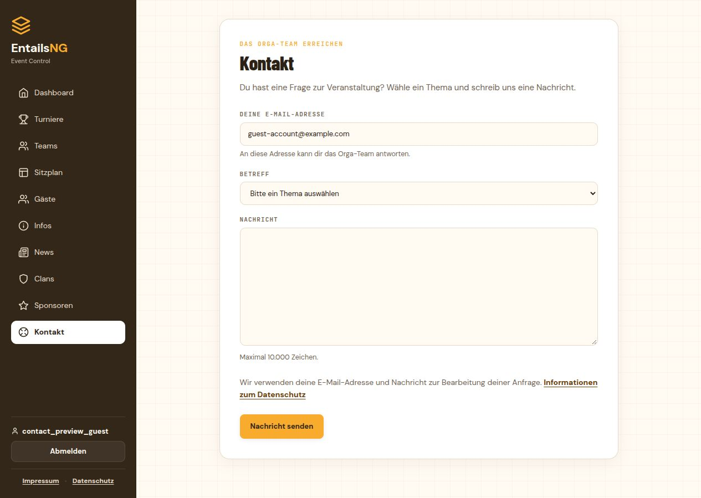

# Kontaktformular

Stand: 8. Oktober 2026.

Unter `/kontakt/` können Besucher das Orga-Team erreichen. Eine Anmeldung ist
optional. Die drei Pflichtfelder sind E-Mail-Adresse, Betreffkategorie und Nachricht.
Bei angemeldeten Gästen ist die Kontoadresse vorbefüllt und weiterhin bearbeitbar;
die Änderung im Formular verändert das Benutzerprofil nicht.

## Einrichtung im Backend

1. Unter **E-Mail Konfiguration → Allgemeine E-Mail Einstellungen** den Versandweg
   und die System-Absenderadresse einrichten. Der bestehende Testmodus kann für
   die Abnahme verwendet werden.
2. Unter **Konfiguration → Allgemeine Konfiguration** die Standardempfänger für
   Kontaktanfragen eintragen. Eine oder mehrere Adressen mit Semikolon trennen,
   beispielsweise `orga@example.com; organisation@example.com`.
3. Auf derselben Seite unter **Kontakt-Betreffkategorien** die Themen anlegen.
   Jede Kategorie hat einen Namen, eine Reihenfolge, einen Aktivierungsstatus und
   eine optionale Empfängerliste, ebenfalls mit `;` getrennt.
4. **Kontaktformular aktivieren** einschalten und speichern. Ein gültiger
   Standardempfänger und mindestens eine aktive Kategorie sind erforderlich.
5. Unter **Konfiguration → Menüpunkte** kann der Menüpunkt **Kontakt** in
   Reihenfolge, Titel und Sichtbarkeit angepasst werden. Bei deaktiviertem
   Kontaktformular wird dieser Menüpunkt verborgen; auch ein direkter POST wird
   dann nicht angenommen.

Die Empfängerlisten werden einzeln validiert, in Kleinschreibung gespeichert und
von Duplikaten bereinigt. Leerzeichen und ein abschließendes Semikolon sind erlaubt.
Pro Liste sind höchstens 20 unterschiedliche Adressen möglich. Kommata oder
Anzeigenamen wie `Orga <orga@example.com>` werden nicht als Adressliste akzeptiert.

| Kategorie | Eigene Empfänger | Ergebnis |
|---|---|---|
| Allgemeine Anfrage | leer | Versand an alle Standardempfänger |
| Tickets und Zahlung | `tickets@example.com; finanzen@example.com` | Versand an diese beiden Adressen |
| Turniere | `turniere@example.com` | Versand an diese Adresse |

Eigene Kategorieempfänger ersetzen die Standardliste. Beim Absenden werden
Aktivierungsstatus und Empfänger erneut aus der Datenbank gelesen. Änderungen
während des Ausfüllens gelten für die neue Anfrage. Bereits gespeicherte
Versandaufträge behalten ihre ursprünglichen Empfänger, auch bei Wiederholungen.

Mitarbeiter benötigen `configuration.change_generalconfiguration` und die
jeweiligen Berechtigungen zum Anzeigen, Hinzufügen, Ändern bzw. Löschen von
`configuration.contactcategory`, um die Kategorien auf dieser Seite zu pflegen.
Superuser haben diese Rechte bereits.

## Versand und Rückmeldungen

Jeder Empfänger erhält einen eigenen Eintrag unter **E-Mail Konfiguration →
Ausgehende E-Mails** mit dem Template-Schlüssel `contact_request`. Dadurch bleiben
die anderen Empfängeradressen verborgen und fehlgeschlagene Zustellungen können
einzeln erneut angestoßen werden. Alle Aufträge einer Anfrage werden gemeinsam in
einer Datenbanktransaktion gespeichert; der Mailworker startet erst nach dem Commit.

Der Absender ist die konfigurierte Systemadresse. Die eingegebene Gastadresse
wird als individuelles **Reply-To** gespeichert und bleibt auch bei einem erneuten
Versand erhalten. Die Antwortfunktion des E-Mail-Programms führt damit direkt zum
Gast. Das globale Reply-To bleibt für andere Systemmails weiterhin wirksam.

Die Vorlage **Kontaktanfrage an das Orga-Team** kann unter **E-Mail Templates**
angepasst werden. Verfügbare Platzhalter sind `{category}`, `{email}`, `{message}`
und `{submitted_at}`. Die Standardvorlage erhält Zeilenumbrüche und enthält den
Eingangszeitpunkt in der Zeitzone Europe/Vienna. Nutzereingaben werden im HTML
maskiert und Platzhalter innerhalb einer Gastnachricht werden nicht erneut ersetzt.

Die Erfolgsanzeige bestätigt die Speicherung der Anfrage. Die tatsächliche
Zustellung erfolgt über die bestehende Warteschlange mit ihren Wiederholungsversuchen
und Statusanzeigen. Versandpausierung und Sandbox gelten ebenfalls für Kontaktmails.
Im Sandbox-Modus gehen alle Empfängerkopien an die konfigurierte Testadresse.
Bei fehlender Konfiguration, inaktiver Vorlage oder fehlenden aktiven Kategorien
zeigt die Seite einen Hinweis zur vorübergehenden Nichtverfügbarkeit.

## Schutz und gespeicherte Daten

Das Formular funktioniert ohne JavaScript. Es verwendet CSRF-Schutz, ein verborgenes
Honeypot-Feld und signierte Formulartokens, die eine Stunde gültig und an Sitzung und
Anmeldestatus gebunden sind. Wiederholte bzw. parallele Übermittlungen desselben
Tokens erstellen keine weiteren Versandaufträge. Datenbank-Sperren und eine
Eindeutigkeitsregel sichern diesen Ablauf auch bei mehreren Webprozessen ab.

Nachrichten sind auf 10.000 Zeichen begrenzt. Standardmäßig sind höchstens fünf
Anfragen pro Absenderadresse und Stunde mit mindestens 60 Sekunden Abstand sowie
100 Anfragen pro Client-IP und zehn Minuten erlaubt. Mehrere Empfängerkopien zählen
dabei als eine Anfrage. Die großzügigere IP-Grenze berücksichtigt gemeinsame
LAN-/NAT-Adressen. Die Limits werden in PostgreSQL geprüft und funktionieren auch
bei einem Redis-Ausfall. Die vorhandene Client-IP-Erkennung berücksichtigt die
konfigurierte Proxy-Vertrauenskette.

Die Warteschlange speichert Nachrichteninhalt, Empfänger, Antwortadresse, Anfrage-ID
und eine HMAC-Kennung für das IP-Limit; die rohe IP-Adresse wird hierfür nicht
gespeichert. Kontaktkopien angemeldeter Gäste sind dem Konto zugeordnet, damit
die bestehende Selbstlöschung auch Kopien mit einer abweichenden Antwortadresse
leeren und ihren Versand beenden kann. Die vorhandenen Aufräumaktionen für
ausgehende E-Mails gelten auch für Kontaktmails. Die Aufbewahrung wird durch diese
Admin-Aufräumaktionen gesteuert. Bereits zugestellte Kopien
im Postfach der Organisatoren werden dadurch nicht entfernt.

Das Formular enthält einen Verarbeitungshinweis und einen Link zur vorhandenen,
im Backend gepflegten Datenschutzerklärung. Betreiber können deren Inhalt passend
zu ihrem Kontaktablauf ergänzen.

## Einführung

Die neuen Migrationen sind `configuration.0024_contact_form` und
`emails.0009_contact_form`. Bestehende Konfigurationen starten mit deaktiviertem
Kontaktformular und leeren Empfängerlisten. Die E-Mail-Erweiterungen sind optional
und erhalten das bisherige Verhalten anderer Systemmails.

```bash
python manage.py migrate
python manage.py seed_translations
python manage.py seed_features
python manage.py seed_email_templates
python manage.py collectstatic --noinput
```

Danach Web- und E-Mail-Prozesse mit dem neuen Code neu starten. Anschließend die
Empfänger und Kategorien wie oben beschrieben einrichten und das Formular aktivieren.
Die Seed-Befehle erhalten vorhandene individuelle Texte, Vorlagen und Menüeinstellungen.

## Prüfung

38 neue Tests sind erfolgreich: 35 Funktionstests und drei PostgreSQL-Paralleltests.
Die vollständige PostgreSQL-Suite besteht mit **1.244 Tests ohne Überspringungen**.
Django-Systemprüfung, globaler Migrationsabgleich und Diff-Prüfung sind erfolgreich.
Alle 31 bestehenden JavaScript-Tests sind ebenfalls erfolgreich.

Browserprüfung auf einer isolierten PostgreSQL-Datenbank: anonymes Absenden mit
zwei Kategorieempfängern, Erfolgsanzeige, Vorbefüllung nach Gastanmeldung sowie
Speichern von Empfängerlisten im Admin. Desktopansicht und Mobilansichten bei
390 und 320 Pixeln sind geprüft; kein horizontaler Seitenüberlauf. Der Versand
verwendet in dieser Vorschau ausschließlich ein lokales E-Mail-Testbackend.
Die beiden Versandaufträge der Browseranfrage wurden dort erfolgreich verarbeitet;
jeweils mit einem Empfänger und dem korrekten individuellen Reply-To.
Ein realer SMTP-Versand, GitHub-CI und Docker-Imagebau wurden nicht ausgeführt.
Die Anwendungsdatenbank wurde nicht migriert und kein Deployment ausgeführt.

```bash
python manage.py test contact --noinput
python manage.py test --noinput
node --test scripts/tests/*.test.cjs
```



Weitere Ansichten: [Mobil](screenshots/contact-mobile.jpg),
[mobile Erfolgsanzeige](screenshots/contact-success-mobile.jpg),
[Backend-Konfiguration](screenshots/contact-admin.jpg).
