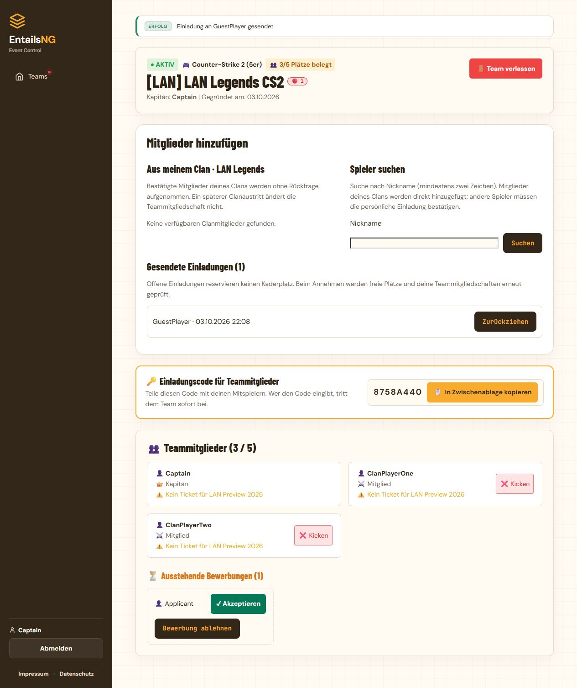
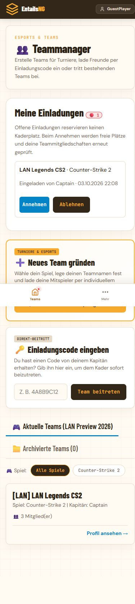

# Mitglieder hinzufügen und persönliche Team-Einladungen

> Seit 5. Oktober 2026 verwendet das Projekt ausschließlich PostgreSQL, auch lokal und für Tests. Testbefehle benötigen eine konfigurierte PostgreSQL-Verbindung; erwähnte SQLite-Ergebnisse sind historische Prüfstände vor der Umstellung. Die vollständige PostgreSQL-Suite einschließlich Parallelität und Backups läuft gemeinsam in CI.

Stand: 3. Oktober 2026.

## Bedienung

Der aktuelle Teamkapitän findet in seinem Teamprofil „Mitglieder hinzufügen“.
Unter „Aus meinem Clan“ stehen bestätigte, verfügbare Clanmitglieder zur
Mehrfachauswahl bereit. Sie werden sofort als Mitglieder aufgenommen. Dafür
braucht der Kapitän keine Clan-Adminrechte. Offene Clanbewerbungen und gleiche
Clan-/Team-Tags berechtigen nicht zur direkten Aufnahme. Ein späterer Clanaustritt
oder eine Clanauflösung lässt die Teammitgliedschaft bestehen.

Die Nickname-Suche zeigt höchstens 20 verfügbare Spieler ab zwei Suchzeichen.
Spieler aus demselben bestätigten Clan werden direkt aufgenommen; andere erhalten
eine persönliche Einladung. Die aktuelle Clanmitgliedschaft wird beim Absenden
erneut geprüft. Die Suche zeigt keine E-Mail-Adressen oder privaten Profildaten.

Eingeladene Spieler finden „Meine Einladungen“ in der Teamübersicht und der
jeweiligen Teamansicht. Nur sie können ihre Einladung annehmen oder ablehnen.
Der Kapitän kann gesendete Einladungen zurückziehen. Bewerbungen bleiben davon
getrennt; der Kapitän kann sie annehmen oder ablehnen. Gibt es schon eine Bewerbung,
entsteht keine zusätzliche Einladung für dasselbe Team und denselben Spieler.

Der rote Punkt am Menüpunkt „Teams“ zeigt eigene offene Einladungen und
offene Bewerbungen an die eigenen Teams an. Er funktioniert in der Seitenleiste
und der mobilen Navigation und verschwindet nicht durch das bloße Lesen einer
Einladung. Direkt aufgenommene Clanmitglieder sehen einen Informationshinweis in
der Teamübersicht und ihrem Teamprofil; sie müssen nichts bestätigen.

Der freiwillige Beitritt über den vorhandenen Einladungscode bleibt erhalten.
Er erledigt eine gegebenenfalls offene persönliche Einladung für dieses Team.

## Regeln und Lebenszyklus

- Nur der aktuelle Kapitän darf Mitglieder hinzufügen oder Einladungen verwalten.
  Mitarbeiterstatus allein ersetzt diese Rolle bei den neuen Aktionen nicht.
- Teamgröße und maximal ein aktives Team pro Spiel gelten weiterhin. Es gibt
  keinen automatischen Wechsel aus einem anderen aktiven Team. Mitgliedschaften
  in archivierten Teams oder Teams für andere Spiele sind erlaubt.
- Die Mehrfachaufnahme ist atomar: Ist ein ausgewählter Spieler nicht verfügbar,
  nicht mehr im selben bestätigten Clan oder übersteigt die Auswahl die freien
  Plätze, wird niemand aus dieser Auswahl aufgenommen.
- Offene Einladungen reservieren keine Plätze. Beim Annehmen werden Verfügbarkeit,
  andere aktive Teams, Kapazität und Turnier-/Veranstaltungsstatus erneut geprüft.
- Archivierte Teams, Einzelspieler-Teams, geschlossene Veranstaltungen und
  laufende oder bereits generierte Turniere erlauben keine Aufnahme.
- Einladungen gehören zur Veranstaltung, die beim Versand aktiv war. Sie werden
  nicht automatisch auf eine neue Veranstaltung übertragen. Archivierung,
  Reaktivierung, Turnierstart, Eventabschluss und Account-Deaktivierung/-Löschung
  erledigen betroffene offene Einladungen. Bereits zeitlich abgelaufene oder
  anderweitig nicht mehr nutzbare Einladungen werden nicht als offen angezeigt.
- Der Beitritt zu einem Team erledigt weitere offene Einladungen für dasselbe
  Spiel. Aufnahme und Einladung erzeugen keine Veranstaltungstickets und ersetzen
  keinen Check-in.

## Umsetzung und Update

`TeamInvitation` speichert Einladung, Empfänger, Absender, Veranstaltung und
Bearbeitungsstatus getrennt von `TeamMember`. Die optionale Herkunft
`TeamMember.added_by` dient dem Informationshinweis bei direkter Clanaufnahme.
Die Logik liegt in `tournaments/services/recruitment.py`; die neuen HTTP-Aktionen
sind POST- und CSRF-geschützt. Benutzer einschließlich neuer Empfänger werden
vor Veranstaltungen und Teams in stabiler Reihenfolge gesperrt. Damit nutzen
die neuen Aktionen die Sperrreihenfolge der bestehenden Kaderaktionen.

Beim Update ausführen:

```bash
python manage.py migrate
python manage.py seed_translations
python manage.py collectstatic --noinput
```

Die neue Migration heißt `tournaments.0012_team_invitations`. Es gibt keine neue
Paketabhängigkeit. Im Docker-Betrieb wird das Image regulär neu gebaut; der
Entrypoint führt die bestehenden Update-Schritte aus.

## Prüfung

- 29 neue Funktionstests für Clanaufnahme, Rechte, Einladungen, CSRF, Kaderregeln,
  Lebenszyklus, Nickname-Suche und Benachrichtigungen erfolgreich.
- Sechs neue Tests für parallele Aufnahme, letzte Kaderplätze, doppelte
  Einladungen, konkurrierenden Codebeitritt, Clanaustritt und Eventabschluss
  vorhanden. Sie benötigen PostgreSQL und werden auf SQLite übersprungen. Der
  bestehende PostgreSQL-CI-Lauf enthält beide neuen Testmodule; PostgreSQL wurde
  für diese Erweiterung lokal nicht ausgeführt.
- Vollständiger SQLite-Projektlauf: 860 Tests, 831 erfolgreich, 29 übersprungen,
  keine Fehler. Der abschließende gezielte Lauf prüft die aktuellen ergänzten
  Sonderfall-Assertions.
- Browserprüfung mit separater temporärer Testdatenbank: Mehrfachaufnahme,
  Nickname-Suche, Versand und Annahme einer Einladung, roter Punkt vor/nach Annahme,
  Desktop sowie 390-Pixel-Mobilansicht ohne horizontales Scrollen. Keine
  Browserfehler in der geprüften Spieleransicht.




