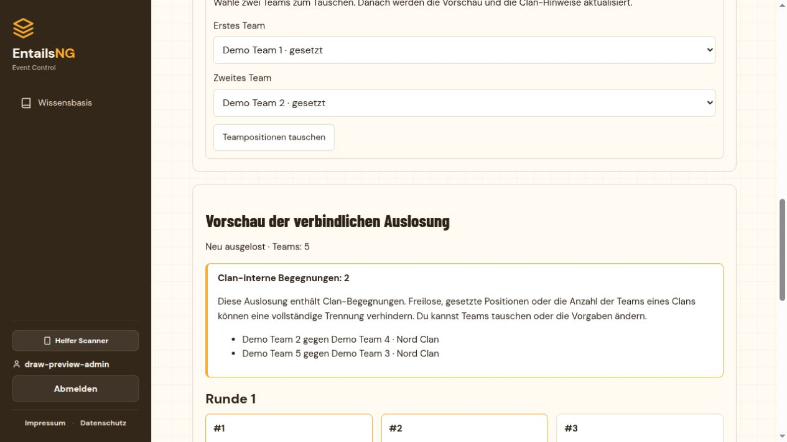

# Turnierauslosung mit Vorschau und Clan-Trennung

Stand: 8. Oktober 2026.

Die Turnierleitung kann vor dem Start die verbindliche Auslosung prüfen,
neu auslosen und zwei Teampositionen manuell tauschen. Erst die abschließende
Freigabe übernimmt genau diese Vorschau, erzeugt die Matches und setzt das
Turnier auf **Läuft aktuell**. Bis dahin bleiben Anmeldung, Matches und
Turnierstatus unverändert.

## Bedienung

1. Bei einem offenen oder geschlossenen, noch nicht gestarteten Turnier
   **Auslosung vorbereiten** öffnen. Turnieradministrator, Support und aktive
   Mitarbeiter/Superuser verwenden dieselben bestehenden Verwaltungsrechte.
2. Für jedes Team bei Bedarf **Clan für diese Auslosung** auswählen.
   **Clan-Vorschläge übernehmen** ergänzt leere Zuordnungen anhand der
   bestätigten Clanmitgliedschaft des Captains. Die Übernahme erfolgt erst
   nach diesem ausdrücklichen Orga-Schritt; bestehende Auswahlen bleiben erhalten.
3. **Vorgaben aktualisieren** übernimmt die Auswahl in die Vorschau.
   **Neu auslosen** verteilt die freien Positionen und minimiert bei aktiver
   Clan-Regel die Clan-Begegnungen. Änderungen an Zuordnungen oder Vorgaben
   sperren mit JavaScript den Start, bis die Vorschau aktualisiert wurde.
4. Zum manuellen Bearbeiten zwei Teams auswählen und
   **Teampositionen tauschen** verwenden. Die Vorschau samt Konflikten wird
   anschließend neu berechnet.
5. Verbleibende Clan-Begegnungen prüfen. Bei aktiver Clan-Regel sind eine
   ausdrückliche Bestätigung und eine Begründung bis 1.000 Zeichen erforderlich.
6. **Auslosung übernehmen & Turnier starten** und anschließend
   **Ja, diese Auslosung starten** wählen. Die Matches entsprechen der
   freigegebenen Vorschau; der Start verwendet keine weitere Zufallsziehung.

Die erste Vorschau zeigt die vorhandene Setzreihenfolge. Zum automatischen
Trennen der Clans ist **Neu auslosen** erforderlich. Ohne JavaScript bleiben
die Bearbeitungsformulare und der abschließende Bestätigungstext mit
Startbutton bedienbar; maßgeblich ist immer die angezeigte, signierte Vorschau.

Im Django-Admin führen Vorschau- und Generierungsaktionen ebenfalls in
diesen Ablauf. Für eine Aktion muss genau ein Turnier ausgewählt sein.
Der Turnier-Admin enthält zusätzlich einen direkten Vorbereitungslink.
Die bisherigen URLs für den Start der ersten Schweizer Runde leiten in
die gemeinsame Auslosung weiter.

## Verhalten der sechs Modi

| Modus | Vorschau und Bearbeitung | Clan-Regel |
|---|---|---|
| Single Elimination | Gesamter K.-o.-Baum, Runde 1 und Freilose; freie Positionen auslosen oder tauschen | Clan-Begegnungen in Runde 1 minimieren |
| Double Elimination | Winners-/Losers-Bracket, Grand Final und Freilose; freie Startpositionen auslosen oder tauschen | Clan-Begegnungen in der ersten Winners-Runde minimieren |
| Gruppenphase | Zwei Gruppen, vollständige Gruppenspielpläne und anschließende K.-o.-Struktur; Teams auch zwischen Gruppen tauschen | Alle Clan-Begegnungen innerhalb der Gruppen minimieren |
| Schweizer System | Verbindliche erste Runde mit gegebenenfalls einem Freilos; freie Startpositionen auslosen oder tauschen | Clan-Begegnungen ausschließlich in Runde 1 minimieren |
| Liga | Vollständiger Spielplan; freie Positionen auslosen oder tauschen erzeugt einen gültigen neuen Spielplan | Clan-Begegnungen am ersten Spieltag minimieren |
| Free For All | Teilnehmer-, Kader- und Clan-Prüfung vor dem gemeinsamen Match | Keine getrennten Paarungen; keine Neuauslosung oder Positionswechsel |

Weitere Schweizer Runden verwenden weiterhin die vorhandene Paarungslogik
mit Punkten, Wiederholungsvermeidung und eigener Rundenfreigabe.
In der Liga begegnet im weiteren Verlauf jedes Team jedem anderen Team.
Die Gruppenphase verwendet weiterhin zwei ausgeglichene Gruppen; ihre
Qualifikations- und K.-o.-Freigaberegeln bleiben erhalten.

## Seeds, Freilose und Grenzen

**Gesetzte Teampositionen beibehalten** ist anfangs aktiv. Teams mit einem
Seed behalten ihre Position in der bisherigen nach Seeds sortierten
Startreihenfolge. Unbesetzte Seednummern erzeugen keine zusätzlichen Plätze.
Doppelte Seeds werden abgelehnt. Das Auslosen verändert keine gespeicherten
Seedwerte. Ein manueller Tausch mit einer gesetzten Position erfordert das
ausdrückliche Deaktivieren dieser Vorgabe. Wird die Vorgabe wieder aktiviert,
beginnt die Vorschau erneut mit der ursprünglichen Setzreihenfolge.

K.-o.-Freilose behalten die zulässigen Plätze im vorhandenen Standardbaum.
Das Auslosen ordnet nur Teams neu zu. Feste Seeds, eine große Anzahl von
Teams desselben Clans oder die verfügbaren Gruppenplätze können vollständige
Clan-Trennung verhindern. Die Zufallsziehung minimiert die Zahl der
Konflikte unter diesen Vorgaben, weist verbleibende Begegnungen aber sichtbar
aus. Manuelle Tausche können neue Konflikte erzeugen.

Die K.-o.-Regel bezieht sich auf die erste **nummerierte** Runde. Ein Team
mit Freilos kann daher in seiner ersten tatsächlich gespielten Begegnung
in Runde 2 auf ein Clan-Team treffen. Spätere K.-o.-Runden und deren Ergebnisse
werden nicht beeinflusst. Eine Garantie für Clan-Trennung über das gesamte
Turnier besteht nicht.

## Zuordnung und Protokoll

`TournamentRegistration.draw_clan` ist eine optionale Zuordnung je
Turnieranmeldung. Team-Tags und persönliche Clanmitgliedschaften werden
davon nicht verändert. Die Auswahl in einem Entwurf wird erst mit der
Freigabe gespeichert; danach ist sie in der Anwendung gesperrt.
Ein bestätigter Turnierneustart übernimmt die Zuordnung in die neue Ausgabe,
die wiederum separat geprüft und ausgelost werden kann.

Nach dem Start zeigt **Auslosungsprotokoll** in der Turnierdetailseite der
Orga die letzten zehn Freigaben. Der Admin führt sämtliche Protokolle als
schreibgeschützte Einträge. Gespeichert werden Bearbeiter, Zeitpunkt, Modus,
Methode, Zufallswert, Vorgaben, Konfliktzahl und Begründung sowie Teilnehmer,
ursprüngliche Seeds, Clan-Zuordnungen, Gruppen und erste Paarungen. Namen
werden im Snapshot mitgespeichert. Protokolle bleiben nach einem zulässigen
Zurücksetzen des Turnierbaums erhalten. Spätere Ergebnisänderungen verwenden
weiterhin das bestehende Ergebnisprotokoll.

## Entwürfe, Validierung und gleichzeitige Aktionen

`TournamentDrawService` erzeugt signierte, an Turnier und Bearbeiter
gebundene Entwürfe mit 30 Minuten Gültigkeit seit der letzten Erstellung
oder Aktualisierung. Es gibt keine Entwurfstabelle und keine gespeicherten
Vorschaumatches. Das erneute Öffnen über den Vorbereitungslink beginnt einen
neuen Entwurf; Entwürfe anderer Bearbeiter lassen sich nicht übernehmen.

Vor Änderungen und Freigabe werden Anmeldung, Seeds, Kader, Turnierregeln
und Zustand erneut mit dem Ausgangsstand verglichen. Zwischenzeitliche
Änderungen verwerfen den Entwurf; eine neue Vorschau ist erforderlich.
Abgelaufene oder manipulierte Entwürfe werden abgelehnt. Rechte werden frisch
geprüft; gesperrte, inaktive oder gelöschte Benutzer können nicht freigeben.
Abgelaufene, beendete oder abgesagte Events und bereits gestartete Turniere
erlauben keine neue Startauslosung.

Die Freigabe prüft alle Startkader und Clan-Referenzen erneut. Sie speichert
Zuordnungen, Matches, Startzustand und Protokoll in einer PostgreSQL-Transaktion
unter den bestehenden Event-/Turnier-/Teamsperren. Fehler rollen den gesamten
Start zurück. Doppelte Übermittlung derselben freigegebenen Vorschau erzeugt
keine weiteren Matches oder Protokolle. Bei konkurrierenden Entwürfen kann
nur einer das Turnier starten. Interne Serviceaufrufe für Tests und bestehende
Verarbeitungslogik bleiben kompatibel; die Orga-Startoberflächen verwenden
den neuen Vorschauablauf.

## Einführung

```sh
python manage.py migrate
python manage.py seed_translations
python manage.py collectstatic --noinput
```

Anschließend die Webprozesse neu starten. Migration
`tournaments.0016_draw_preview` ergänzt die nullable Clan-Zuordnung und das
Auslosungsprotokoll. Bestehende Turniere und Paarungen werden nicht
umgeschrieben; bestehende Zuordnungen beginnen leer. Die Migration hängt
von `tournaments.0015_external_tournament` und
`clans.0007_alter_clan_seat_limit_override` ab. Auf diesem Arbeitsstand können
weitere noch nicht eingespielte Migrationen vorhanden sein.

Keine neuen Pakete, Umgebungsvariablen, externen Dienste oder
Hintergrundprozesse erforderlich. Für die Optimierung wird das bereits
vorhandene NetworkX verwendet. Die Texte aus `tournaments/draw_texts.py`
werden über das bestehende Übersetzungssystem gepflegt.

Die Anwendungsdatenbank wurde für diese Umsetzung nicht migriert.
Migration, Beispieldaten und Browserstarts wurden ausschließlich auf einer
isolierten PostgreSQL-Datenbank geprüft. Kein Deployment ausgeführt.

## Prüfung

```sh
python manage.py test tournaments.test_draws tournaments.test_draw_concurrency --noinput
python manage.py test --noinput
node --test --test-isolation=none scripts/tests/*.test.cjs
python manage.py check
python manage.py makemigrations --check --dry-run
```

- **31 neue Funktionstests**: alle sechs Modi, exakte Vorschauübernahme,
  K.-o.-Feldgrößen und Freilose, Clan-Minimierung und Konfliktfreigabe,
  Seed-Schutz und manuelle Tausche, Gruppen-/Ligaspielpläne, Schweizer
  Folgerunde, FFA, Vorschläge, Kader, Tokenablauf, Rechte, CSRF, Neustart,
  schreibgeschütztes Protokoll und atomare Fehlerfälle.
- **Sechs neue PostgreSQL-Paralleltests**: gleiche und konkurrierende
  Freigaben, Anmeldung vor/nach Start, Kaderänderung und Eventabschluss.
- Vollständige Suite: **1.206 Python-Tests erfolgreich, keine Überspringungen**,
  gegen isoliertes PostgreSQL 18.6 einschließlich nativer Backupprüfungen.
- **31 JavaScript-Tests erfolgreich**, davon fünf neue Auslosungstests.
  Lokal mit Node 24 und deaktivierter Testprozessisolation ausgeführt,
  sodass alle Einzeltests sichtbar liefen.
- Django-Systemprüfung, globaler Migrationsabgleich, Python-Syntaxprüfung
  und Diff-Prüfung erfolgreich.
- Browser: alle sechs Modi bis zum erfolgreichen Start geprüft; Clan-Auswahl,
  Neuauslosung, manueller Tausch, Startschutz bei offenen Änderungen und
  ausdrückliche Konfliktfreigabe geprüft. Gruppenphase bei 390 Pixeln und
  Double Elimination bei 320 Pixeln ohne horizontalen Seitenüberlauf.
- GitHub-CI und Docker-Imagebau wurden lokal nicht ausgeführt.

Vorschau mit synthetischen Beispieldaten:


